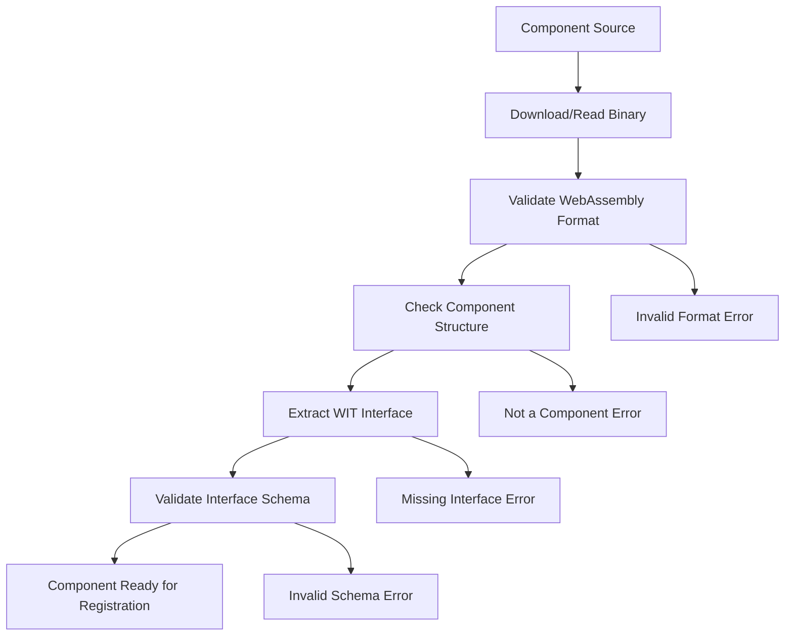
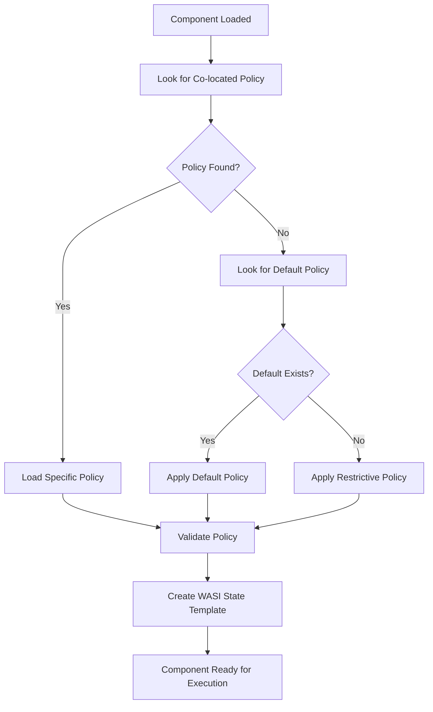
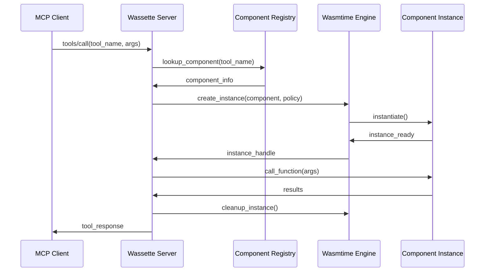
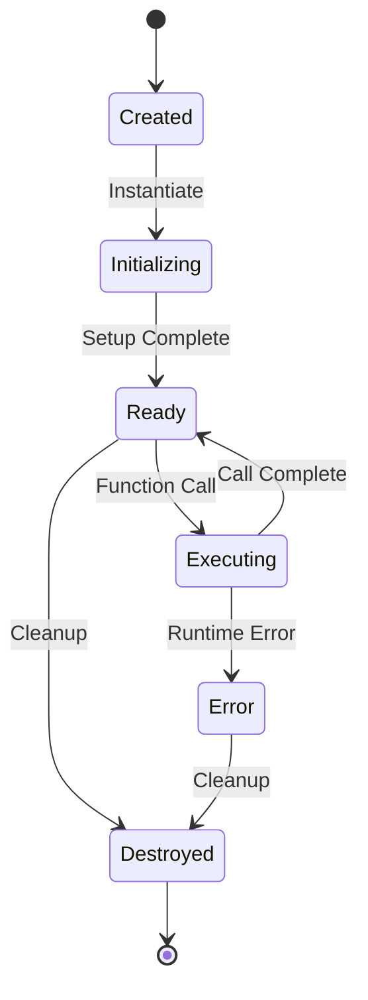

# Component Lifecycle

Understanding the lifecycle of WebAssembly components in Wassette is crucial for both users and developers. This document details how components are loaded, registered, executed, and managed throughout their operational lifetime.

## Overview

Components in Wassette go through several distinct phases from loading to execution:

1. **Discovery** - Finding components from various sources
2. **Loading** - Downloading and validating component binaries
3. **Registration** - Extracting interfaces and creating MCP tool mappings
4. **Policy Application** - Applying security policies and creating runtime templates
5. **Execution** - Creating instances and running tool functions
6. **Cleanup** - Resource management and instance disposal

## Component Discovery

Components can be discovered from multiple sources:

### Local Files
```bash
# Absolute file path
wassette component load file:///path/to/component.wasm

# Relative file path (from working directory)
wassette component load file://./components/my-tool.wasm
```

### OCI Registries
```bash
# GitHub Container Registry
wassette component load oci://ghcr.io/myorg/my-tool:v1.0.0

# Docker Hub
wassette component load oci://docker.io/myorg/my-tool:latest

# Private registry
wassette component load oci://registry.company.com/tools/my-tool:v2.1.0
```

### HTTP/HTTPS URLs
```bash
# Direct download
wassette component load https://releases.example.com/my-tool.wasm

# With authentication
wassette component load https://private.example.com/my-tool.wasm --auth-token $TOKEN
```

## Loading Phase

### Component Validation

When a component is loaded, Wassette performs several validation steps:



### Binary Validation
- **WebAssembly format**: Verify valid Wasm binary structure
- **Component format**: Ensure it's a Component, not just a Module
- **Version compatibility**: Check Component Model version support
- **Size limits**: Enforce maximum component size policies

### Interface Extraction
```rust
// Extracted WIT interface example
world my-tool {
  export process-data: func(input: string) -> result<string, string>;
  export get-status: func() -> string;
  import wasi:filesystem/types@0.2.0;
  import wasi:http/outgoing-handler@0.2.0;
}
```

## Registration Phase

### Tool Discovery

Wassette automatically discovers MCP tools from WIT exports:

```wit
// WIT definition
export process-text: func(text: string, options: record { uppercase: bool }) -> result<string, string>;
```

Becomes an MCP tool:
```json
{
  "name": "process_text",
  "description": "Process text with options",
  "inputSchema": {
    "type": "object",
    "properties": {
      "text": {"type": "string"},
      "options": {
        "type": "object",
        "properties": {
          "uppercase": {"type": "boolean"}
        }
      }
    },
    "required": ["text", "options"]
  }
}
```

### Schema Generation

Wassette generates JSON schemas for each tool:

1. **Function signature parsing**: Extract parameter and return types from WIT
2. **Type mapping**: Convert WIT types to JSON Schema types
3. **Documentation extraction**: Include comments as descriptions
4. **Validation rules**: Generate schema validation rules

### Registry Update

The component registry maintains:
- **Component metadata**: ID, source, version, timestamp
- **Tool mappings**: Function name to MCP tool mapping
- **Dependencies**: WASI imports and their versions
- **Capabilities**: Required permissions extracted from WIT

## Policy Application Phase

### Policy Resolution

When a component is loaded, Wassette resolves its security policy:



### WASI State Template Creation

The policy is compiled into a WASI state template that defines:

```rust
struct WasiStateTemplate {
    // Filesystem permissions
    filesystem_permissions: HashMap<PathBuf, AccessType>,
    
    // Network permissions
    network_permissions: Vec<NetworkRule>,
    
    // Environment variables
    environment_variables: HashMap<String, String>,
    
    // Resource limits
    memory_limit: Option<usize>,
    execution_timeout: Option<Duration>,
}
```

## Execution Phase

### Instance Creation

For each tool call, Wassette creates a fresh component instance:



### Runtime Isolation

Each instance operates in complete isolation:

- **Memory isolation**: Separate linear memory space
- **Capability isolation**: WASI state enforces policy restrictions
- **Resource isolation**: CPU and memory limits applied
- **Network isolation**: Only permitted connections allowed

### Function Execution

When a tool is called:

1. **Parameter validation**: Verify inputs match WIT schema
2. **Type conversion**: Convert JSON to WIT types
3. **Function invocation**: Call the component function
4. **Result processing**: Convert WIT results back to JSON
5. **Error handling**: Map component errors to MCP errors

## Instance Management

### Instance Lifecycle



### Resource Management

**Memory Management:**
- Each instance gets isolated linear memory
- Memory is automatically reclaimed when instance is destroyed
- No shared memory between instances

**File Handle Management:**
- Component can open files within policy permissions
- File handles are automatically closed on instance cleanup
- No handle leakage between calls

**Network Connection Management:**
- Connections are scoped to instance lifetime
- Automatic cleanup of open connections
- Connection pooling for performance (where safe)

### Current Implementation

Wassette currently implements a straightforward component lifecycle:
- Components are loaded once during startup or via explicit load commands
- Each component instance runs independently without pooling
- Components remain loaded until explicitly unloaded or the server restarts

## Component Management

Components can be managed through the CLI:

```bash
# Load a component manually
wassette component load oci://ghcr.io/myorg/my-tool:latest

# List loaded components  
wassette component list

# Unload a component
wassette component unload my-tool
```

When making changes to components:
- Stop the server to update components in the plugin directory
- Restart the server to load the updated components
- Use explicit load/unload commands for runtime component management

## Monitoring and Observability

### Lifecycle Events

Wassette emits events for each lifecycle phase:

```rust
// Example lifecycle events
ComponentLoaded {
    component_id: String,
    source: String,
    timestamp: DateTime<Utc>,
}

InstanceCreated {
    component_id: String,
    instance_id: String,
    policy_hash: String,
}

FunctionCalled {
    component_id: String,
    instance_id: String,
    function_name: String,
    duration: Duration,
}
```

### Metrics

Key metrics tracked:
- **Load time**: Time to load and register components
- **Instance creation time**: Time to create new instances
- **Function execution time**: Time per tool call
- **Memory usage**: Per-instance and total memory consumption
- **Error rates**: Component load failures, execution errors

### Health Checks

Components can implement health check functions:

```wit
export health-check: func() -> result<string, string>;
```

Wassette can periodically call these to verify component health.

## Error Handling and Recovery

### Load-Time Errors

Common component loading errors and recovery strategies:

- **Invalid binary**: Clear error message with validation details
- **Missing dependencies**: List required WASI interfaces
- **Policy violations**: Specific permission conflicts

### Runtime Errors

Runtime error handling:
- **Trap handling**: Convert WebAssembly traps to MCP errors
- **Timeout handling**: Kill and clean up long-running instances
- **Resource exhaustion**: Graceful handling of memory/CPU limits

### Error Handling

When component instances fail:
- **Instance termination**: Failed instances are cleaned up automatically
- **Error reporting**: Clear error messages are returned to the MCP client
- **Resource cleanup**: WASI resources are properly released

## Best Practices

### For Component Developers

1. **Stateless design**: Make components stateless for better reliability
2. **Resource efficiency**: Minimize memory and CPU usage
3. **Error handling**: Provide clear error messages for tool failures
4. **Graceful failures**: Handle errors without crashing the component

### For Operations

1. **Monitoring**: Monitor component execution through logs
2. **Resource limits**: Configure appropriate policy-based resource limits
3. **Testing**: Test components with restricted permissions before deployment
4. **Documentation**: Document required permissions for each component

## Next Steps

- Learn about the [Policy Engine](./policy-engine.md) architecture
- Explore [Security & Sandboxing](../security/sandboxing-overview.md) details
- Check out [Developing Components](../developing/getting-started.md) guides