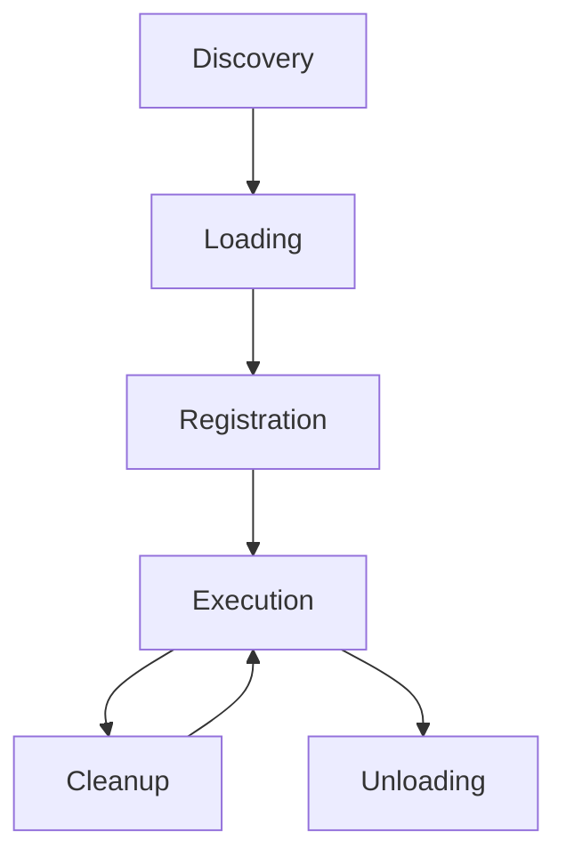
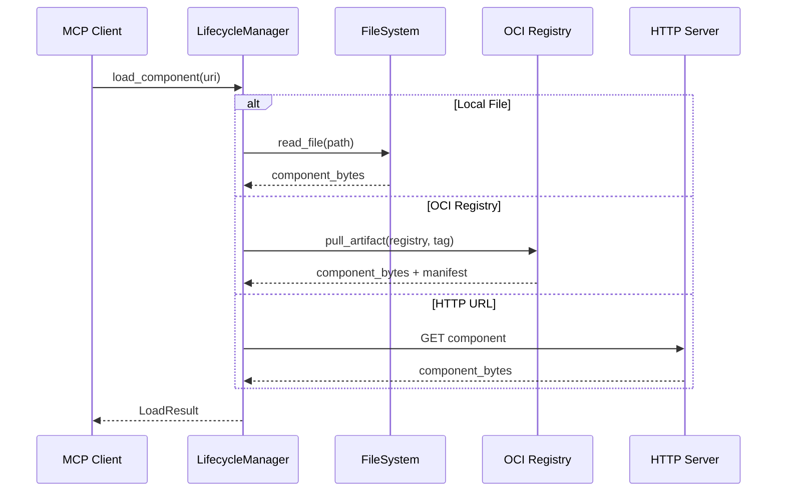

# Component Lifecycle

Understanding the component lifecycle in Wassette is essential for effective debugging, monitoring, and optimization. This guide covers how components are loaded, executed, and managed throughout their operational lifetime.

## Lifecycle Overview

The Wassette component lifecycle consists of five main phases:



### Phase Summary

1. **Discovery**: Component URI resolution and retrieval
2. **Loading**: WebAssembly compilation and validation
3. **Registration**: Interface extraction and tool registration
4. **Execution**: Instance creation and function invocation
5. **Cleanup**: Resource deallocation and state reset

## Phase 1: Discovery

Discovery involves resolving component URIs and retrieving component binaries.

### URI Resolution

Wassette supports multiple component sources:

```rust
pub enum ComponentSource {
    /// Local file system
    File(PathBuf),
    /// OCI registry
    Oci { registry: String, tag: String },
    /// HTTP/HTTPS URL
    Http(Url),
    /// Embedded component
    Embedded(Vec<u8>),
}

impl ComponentSource {
    pub fn from_uri(uri: &str) -> Result<Self, Error> {
        if uri.starts_with("file://") {
            Ok(ComponentSource::File(PathBuf::from(&uri[7..])))
        } else if uri.starts_with("oci://") {
            Self::parse_oci_uri(&uri[6..])
        } else if uri.starts_with("http://") || uri.starts_with("https://") {
            Ok(ComponentSource::Http(Url::parse(uri)?))
        } else {
            // Try as local file path
            Ok(ComponentSource::File(PathBuf::from(uri)))
        }
    }
}
```

### Component Retrieval

Different sources require different retrieval mechanisms:



### Caching Strategy

Components are cached to improve performance:

```rust
pub struct ComponentCache {
    cache_dir: PathBuf,
    max_size: u64,
    ttl: Duration,
}

impl ComponentCache {
    /// Get component from cache or fetch if not present
    pub async fn get_or_fetch(
        &self,
        source: &ComponentSource
    ) -> Result<CachedComponent, Error> {
        let cache_key = self.compute_cache_key(source);
        let cache_path = self.cache_dir.join(&cache_key);
        
        // Check if cached version exists and is valid
        if let Ok(cached) = self.load_from_cache(&cache_path).await {
            if !self.is_expired(&cached) {
                return Ok(cached);
            }
        }
        
        // Fetch from source
        let component_bytes = self.fetch_from_source(source).await?;
        
        // Validate and cache
        let component = self.validate_component(&component_bytes)?;
        self.store_in_cache(&cache_path, &component).await?;
        
        Ok(component)
    }
    
    fn is_expired(&self, cached: &CachedComponent) -> bool {
        cached.timestamp.elapsed() > self.ttl
    }
}
```

## Phase 2: Loading

Loading involves compiling WebAssembly bytecode and validating component structure.

### WebAssembly Compilation

Components are compiled using Wasmtime:

```rust
pub struct ComponentLoader {
    engine: Engine,
    config: LoaderConfig,
}

impl ComponentLoader {
    pub fn load_component(&self, bytes: &[u8]) -> Result<LoadedComponent, Error> {
        // Configure compilation settings
        let mut config = wasmtime::Config::new();
        config.wasm_component_model(true);
        config.async_support(true);
        
        // Set resource limits
        config.max_wasm_stack(self.config.max_stack_size);
        config.consume_fuel(true);
        
        // Compile component
        let component = Component::from_binary(&self.engine, bytes)
            .map_err(|e| Error::CompilationFailed(e.to_string()))?;
        
        // Extract metadata
        let metadata = self.extract_metadata(&component)?;
        
        Ok(LoadedComponent {
            component,
            metadata,
            load_time: std::time::Instant::now(),
        })
    }
    
    fn extract_metadata(&self, component: &Component) -> Result<ComponentMetadata, Error> {
        // Extract WIT interface definitions
        let interfaces = self.extract_interfaces(component)?;
        
        // Extract custom sections
        let custom_sections = self.extract_custom_sections(component)?;
        
        // Parse component name and version
        let (name, version) = self.parse_component_info(component)?;
        
        Ok(ComponentMetadata {
            name,
            version,
            interfaces,
            custom_sections,
        })
    }
}
```

### Validation

Components undergo comprehensive validation:

```rust
pub struct ComponentValidator {
    security_policy: SecurityPolicy,
    resource_limits: ResourceLimits,
}

impl ComponentValidator {
    pub fn validate(&self, component: &LoadedComponent) -> Result<ValidationResult, Error> {
        let mut result = ValidationResult::new();
        
        // Validate WIT interfaces
        self.validate_interfaces(&component.metadata.interfaces, &mut result)?;
        
        // Validate security requirements
        self.validate_security(&component, &mut result)?;
        
        // Validate resource requirements
        self.validate_resources(&component, &mut result)?;
        
        // Check for known vulnerabilities
        self.scan_vulnerabilities(&component, &mut result)?;
        
        if result.has_errors() {
            return Err(Error::ValidationFailed(result.errors));
        }
        
        Ok(result)
    }
    
    fn validate_interfaces(
        &self,
        interfaces: &[WitInterface],
        result: &mut ValidationResult
    ) -> Result<(), Error> {
        for interface in interfaces {
            // Check interface compatibility
            if !self.is_compatible_interface(interface) {
                result.add_error(format!(
                    "Interface {} version {} is not compatible",
                    interface.name, interface.version
                ));
            }
            
            // Validate function signatures
            for function in &interface.functions {
                self.validate_function_signature(function, result)?;
            }
        }
        
        Ok(())
    }
}
```

## Phase 3: Registration

Registration makes component functions available as MCP tools.

### Interface Extraction

WIT interfaces are extracted and converted to MCP tool schemas:

```rust
pub struct ToolRegistry {
    tools: HashMap<String, ToolDefinition>,
    schemas: HashMap<String, JsonSchema>,
}

impl ToolRegistry {
    pub fn register_component(
        &mut self,
        component_id: &str,
        metadata: &ComponentMetadata
    ) -> Result<Vec<ToolDefinition>, Error> {
        let mut registered_tools = Vec::new();
        
        for interface in &metadata.interfaces {
            for function in &interface.functions {
                let tool_name = format!("{}:{}", component_id, function.name);
                
                // Generate JSON schema from WIT function signature
                let schema = self.generate_schema(function)?;
                
                // Create tool definition
                let tool = ToolDefinition {
                    name: tool_name.clone(),
                    description: function.description.clone(),
                    input_schema: schema.clone(),
                    component_id: component_id.to_string(),
                    function_name: function.name.clone(),
                };
                
                // Register tool
                self.tools.insert(tool_name.clone(), tool.clone());
                self.schemas.insert(tool_name, schema);
                
                registered_tools.push(tool);
            }
        }
        
        Ok(registered_tools)
    }
    
    fn generate_schema(&self, function: &WitFunction) -> Result<JsonSchema, Error> {
        let mut schema = JsonSchema::object();
        
        for param in &function.parameters {
            let param_schema = self.wit_type_to_json_schema(&param.type_info)?;
            schema.add_property(&param.name, param_schema);
            
            if param.required {
                schema.add_required(&param.name);
            }
        }
        
        Ok(schema)
    }
}
```

### Policy Application

Security policies are loaded and applied during registration:

```rust
pub struct PolicyManager {
    policies: HashMap<String, ComponentPolicy>,
    default_policy: ComponentPolicy,
}

impl PolicyManager {
    pub fn apply_policy(
        &self,
        component_id: &str,
        component: &LoadedComponent
    ) -> Result<AppliedPolicy, Error> {
        // Load component-specific policy
        let policy = self.load_policy(component_id, component)?;
        
        // Validate policy against component requirements
        self.validate_policy(&policy, component)?;
        
        // Create WASI configuration from policy
        let wasi_config = self.create_wasi_config(&policy)?;
        
        Ok(AppliedPolicy {
            policy,
            wasi_config,
            applied_at: std::time::Instant::now(),
        })
    }
    
    fn load_policy(
        &self,
        component_id: &str,
        component: &LoadedComponent
    ) -> Result<ComponentPolicy, Error> {
        // Try component-specific policy
        if let Some(policy) = self.policies.get(component_id) {
            return Ok(policy.clone());
        }
        
        // Try embedded policy
        if let Some(policy_bytes) = component.metadata.custom_sections.get("policy") {
            let policy: ComponentPolicy = serde_yaml::from_slice(policy_bytes)?;
            return Ok(policy);
        }
        
        // Fall back to default policy
        Ok(self.default_policy.clone())
    }
}
```

## Phase 4: Execution

Execution involves creating component instances and invoking functions.

### Instance Creation

Fresh instances are created for each execution:

```rust
pub struct ComponentExecutor {
    engine: Engine,
    linker: Linker<WasiState>,
}

impl ComponentExecutor {
    pub async fn execute_function(
        &self,
        component: &LoadedComponent,
        policy: &AppliedPolicy,
        function_name: &str,
        args: &Value
    ) -> Result<Value, Error> {
        // Create fresh WASI state for this execution
        let mut store = Store::new(&self.engine, policy.wasi_config.create_state()?);
        
        // Set fuel limit for this execution
        store.fuel_async_yield_interval(Some(1000))?;
        store.set_fuel(policy.policy.limits.fuel_limit)?;
        
        // Instantiate component
        let instance = self.linker.instantiate_async(&mut store, &component.component).await?;
        
        // Get function handle
        let func = instance
            .get_typed_func::<(Value,), (Value,)>(&mut store, function_name)?;
        
        // Execute function with timeout
        let execution_future = func.call_async(&mut store, (args.clone(),));
        let timeout_duration = Duration::from_secs(policy.policy.limits.execution_timeout);
        
        match tokio::time::timeout(timeout_duration, execution_future).await {
            Ok(Ok((result,))) => Ok(result),
            Ok(Err(e)) => Err(Error::ExecutionFailed(e.to_string())),
            Err(_) => Err(Error::ExecutionTimeout),
        }
    }
}
```

### Resource Management

Resource usage is tracked and limited during execution:

```rust
pub struct ResourceMonitor {
    memory_usage: Arc<AtomicU64>,
    cpu_time: Arc<AtomicU64>,
    io_operations: Arc<AtomicU32>,
}

impl ResourceMonitor {
    pub fn create_store_limits(&self, limits: &ResourceLimits) -> StoreLimits {
        StoreLimits::builder()
            .memory_size(limits.max_memory)
            .table_elements(limits.max_table_elements)
            .instances(limits.max_instances)
            .tables(limits.max_tables)
            .memories(limits.max_memories)
            .build()
    }
    
    pub fn monitor_execution<F, R>(&self, limits: &ResourceLimits, f: F) -> Result<R, Error>
    where
        F: FnOnce() -> Result<R, Error>,
    {
        let start_memory = self.memory_usage.load(Ordering::Relaxed);
        let start_cpu = self.cpu_time.load(Ordering::Relaxed);
        let start_time = std::time::Instant::now();
        
        // Execute function
        let result = f()?;
        
        // Check resource usage
        let memory_used = self.memory_usage.load(Ordering::Relaxed) - start_memory;
        let cpu_used = self.cpu_time.load(Ordering::Relaxed) - start_cpu;
        let wall_time = start_time.elapsed();
        
        if memory_used > limits.max_memory {
            return Err(Error::MemoryLimitExceeded(memory_used));
        }
        
        if wall_time > Duration::from_secs(limits.execution_timeout) {
            return Err(Error::ExecutionTimeout);
        }
        
        Ok(result)
    }
}
```

## Phase 5: Cleanup

Cleanup ensures resources are properly released after execution.

### Automatic Cleanup

Resources are automatically cleaned up after each execution:

```rust
impl Drop for ComponentInstance {
    fn drop(&mut self) {
        // Close file handles
        for handle in &self.file_handles {
            let _ = handle.close();
        }
        
        // Close network connections
        for conn in &self.network_connections {
            let _ = conn.close();
        }
        
        // Release memory allocations
        self.memory.clear();
        
        // Update resource counters
        self.resource_monitor.release_resources(&self.resource_usage);
    }
}
```

### Memory Management

WebAssembly linear memory is managed automatically:

```rust
pub struct MemoryManager {
    allocations: HashMap<u32, Allocation>,
    total_allocated: AtomicU64,
    peak_usage: AtomicU64,
}

impl MemoryManager {
    pub fn track_allocation(&self, ptr: u32, size: u32) {
        let allocation = Allocation {
            ptr,
            size,
            timestamp: std::time::Instant::now(),
        };
        
        self.allocations.insert(ptr, allocation);
        
        let total = self.total_allocated.fetch_add(size as u64, Ordering::Relaxed) + size as u64;
        
        // Update peak usage
        self.peak_usage.fetch_max(total, Ordering::Relaxed);
    }
    
    pub fn track_deallocation(&self, ptr: u32) {
        if let Some(allocation) = self.allocations.remove(&ptr) {
            self.total_allocated.fetch_sub(allocation.size as u64, Ordering::Relaxed);
        }
    }
    
    pub fn get_stats(&self) -> MemoryStats {
        MemoryStats {
            current_usage: self.total_allocated.load(Ordering::Relaxed),
            peak_usage: self.peak_usage.load(Ordering::Relaxed),
            active_allocations: self.allocations.len(),
        }
    }
}
```

## Lifecycle Events

Wassette emits events throughout the component lifecycle:

```rust
#[derive(Debug, Clone)]
pub enum LifecycleEvent {
    ComponentDiscovered { uri: String, source: ComponentSource },
    ComponentLoading { component_id: String },
    ComponentLoaded { component_id: String, load_time: Duration },
    ComponentRegistered { component_id: String, tools: Vec<String> },
    FunctionCalled { component_id: String, function: String, args: Value },
    FunctionCompleted { component_id: String, function: String, result: Value, duration: Duration },
    FunctionFailed { component_id: String, function: String, error: String },
    ComponentUnloaded { component_id: String },
}

pub trait LifecycleListener: Send + Sync {
    fn on_event(&self, event: LifecycleEvent);
}

pub struct EventBus {
    listeners: Vec<Box<dyn LifecycleListener>>,
}

impl EventBus {
    pub fn emit(&self, event: LifecycleEvent) {
        for listener in &self.listeners {
            listener.on_event(event.clone());
        }
    }
}
```

## Monitoring and Debugging

### Lifecycle Tracing

Enable detailed tracing of lifecycle events:

```bash
# Enable lifecycle tracing
RUST_LOG=wassette::lifecycle=trace wassette serve --stdio

# Example output:
# TRACE wassette::lifecycle: component_discovered uri="oci://ghcr.io/example/tool:v1.0.0"
# TRACE wassette::lifecycle: component_loading component_id="example-tool"
# TRACE wassette::lifecycle: component_loaded component_id="example-tool" load_time=142ms
# TRACE wassette::lifecycle: component_registered component_id="example-tool" tools=["process-data", "get-info"]
```

### Metrics Collection

Collect lifecycle metrics for monitoring:

```rust
pub struct LifecycleMetrics {
    pub components_loaded: Counter,
    pub load_duration: Histogram,
    pub execution_duration: Histogram,
    pub memory_usage: Gauge,
    pub active_instances: Gauge,
}

impl LifecycleMetrics {
    pub fn record_load(&self, duration: Duration) {
        self.components_loaded.inc();
        self.load_duration.observe(duration.as_secs_f64());
    }
    
    pub fn record_execution(&self, duration: Duration, memory_used: u64) {
        self.execution_duration.observe(duration.as_secs_f64());
        self.memory_usage.set(memory_used as f64);
    }
}
```

## Troubleshooting

### Common Issues

**Component Loading Failures**
- Check WebAssembly validity with `wasm-validate`
- Verify WIT interface syntax
- Ensure component model features are enabled

**Registration Failures**
- Validate WIT interface definitions
- Check for naming conflicts
- Verify component exports match interface

**Execution Failures**
- Check resource limits and permissions
- Verify function signatures match
- Review error logs for specific issues

### Debug Commands

```bash
# Inspect component metadata
wassette component inspect ./component.wasm

# Trace component loading
RUST_LOG=wassette::loader=debug wassette component load ./component.wasm

# Monitor resource usage during execution
wassette component call my-tool process-data --monitor --args '{"input": "test"}'
```

## Next Steps

- Learn about [Runtime Design](./runtime-design.md) for lower-level details
- Explore [System Architecture](../design/architecture.md) for high-level overview
- Review [Security Model](../security/security-model.md) for security considerations
- Check [Best Practices](../development/best-practices.md) for optimization guidelines