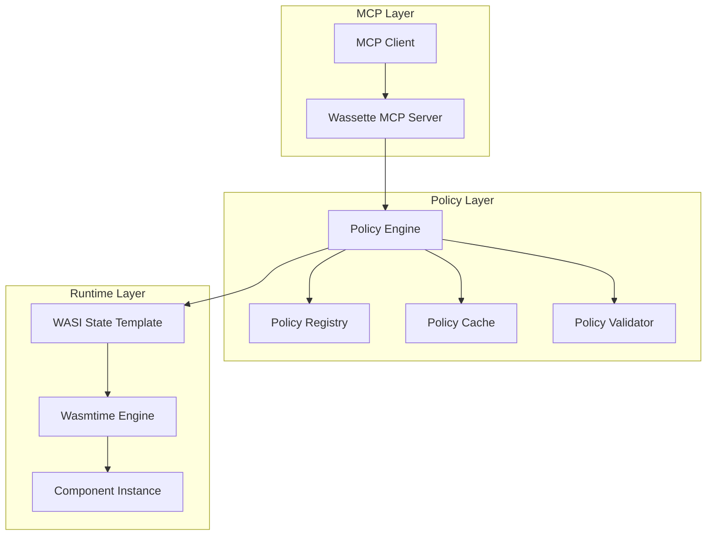
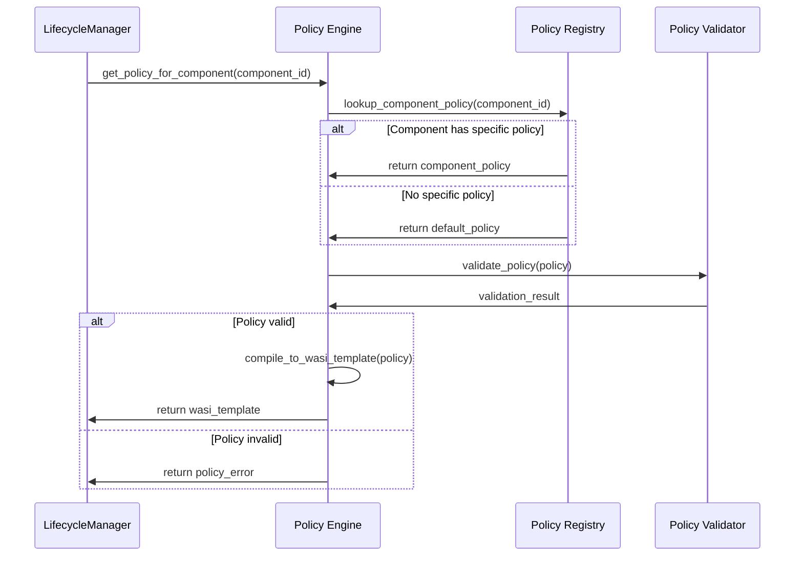
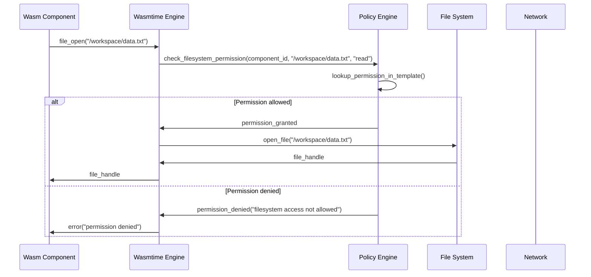

# Policy Engine

The Policy Engine is the core security component in Wassette that enforces capability-based access control for WebAssembly components. It manages policies, creates runtime security contexts, and enforces permissions at execution time.

## Architecture Overview

The Policy Engine sits between the MCP server and the WebAssembly runtime, ensuring that all component operations are authorized by their assigned policies.



## Core Components

### Policy Registry

The Policy Registry manages the lifecycle of security policies:

```rust
struct PolicyRegistry {
    // Component-specific policies
    component_policies: HashMap<String, Arc<PolicyDocument>>,
    
    // Default policies for different component types
    default_policies: HashMap<String, Arc<PolicyDocument>>,
    
    // Policy sources (file paths, URLs, etc.)
    policy_sources: HashMap<String, PolicySource>,
    
    // Runtime WASI state templates
    wasi_templates: HashMap<String, Arc<WasiStateTemplate>>,
}
```

**Key responsibilities:**
- Store and retrieve component policies
- Manage policy associations with components
- Handle policy updates and versioning
- Provide default policies for components without specific policies

### Policy Cache

Optimizes policy loading and compilation:

```rust
struct PolicyCache {
    // Compiled WASI state templates
    compiled_templates: LruCache<String, Arc<WasiStateTemplate>>,
    
    // Policy parsing cache
    parsed_policies: LruCache<PolicyHash, Arc<PolicyDocument>>,
    
    // Network permission lookup cache
    network_cache: HashMap<String, NetworkPermissions>,
    
    // Filesystem permission lookup cache
    storage_cache: HashMap<String, StoragePermissions>,
}
```

**Benefits:**
- Reduces policy compilation time
- Improves component instantiation performance
- Enables efficient permission lookups during runtime

### Policy Validator

Ensures policy correctness and security:

```rust
struct PolicyValidator {
    // JSON schema for policy validation
    policy_schema: JSONSchema,
    
    // Security rules and constraints
    security_rules: Vec<SecurityRule>,
    
    // Maximum permission limits
    limits: PolicyLimits,
}
```

**Validation checks:**
- Schema compliance
- Permission conflicts
- Security constraints
- Resource limits

## Policy Application Flow

### 1. Policy Resolution

When a component is loaded, the Policy Engine resolves its security policy:



### 2. WASI State Template Creation

Policies are compiled into WASI state templates that define runtime permissions:

```rust
struct WasiStateTemplate {
    // Allowed filesystem paths and operations
    filesystem_permissions: Vec<FilesystemPermission>,
    
    // Allowed network hosts and ports
    network_permissions: Vec<NetworkPermission>,
    
    // Accessible environment variables
    environment_permissions: Vec<EnvironmentPermission>,
    
    // Resource limits
    resource_limits: ResourceLimits,
    
    // Security context
    security_context: SecurityContext,
}
```

### 3. Runtime Enforcement

During component execution, the Policy Engine enforces permissions:



## Permission Types and Enforcement

### Filesystem Permissions

Controlled through WASI filesystem capabilities:

```rust
struct FilesystemPermission {
    // Path pattern (supports wildcards)
    path_pattern: PathPattern,
    
    // Allowed operations
    access_types: Vec<AccessType>, // read, write, execute
    
    // Additional constraints
    constraints: Option<FilesystemConstraints>,
}

enum AccessType {
    Read,
    Write,
    Execute,
    Create,
    Delete,
}
```

**Enforcement points:**
- `path_open` - File/directory opening
- `fd_read` - Reading file contents
- `fd_write` - Writing file contents
- `path_create_directory` - Directory creation
- `path_remove_directory` - Directory deletion

### Network Permissions

Managed through WASI networking interfaces:

```rust
struct NetworkPermission {
    // Target host (supports wildcards)
    host_pattern: HostPattern,
    
    // Allowed ports (None = any port)
    ports: Option<Vec<u16>>,
    
    // Protocol restrictions
    protocols: Vec<Protocol>, // TCP, UDP, HTTP, HTTPS
    
    // Connection limits
    limits: Option<NetworkLimits>,
}
```

**Enforcement points:**
- `tcp_connect` - TCP connection establishment
- `udp_bind` - UDP socket binding
- HTTP client requests through WASI HTTP interface

### Environment Variable Permissions

Controls access to environment variables:

```rust
struct EnvironmentPermission {
    // Variable name pattern
    variable_pattern: VarPattern,
    
    // Access type (read-only currently)
    access_type: EnvAccessType,
}
```

**Enforcement points:**
- `environ_get` - Reading all environment variables
- `environ_sizes_get` - Getting environment size information

## Policy Management Operations

### Runtime Policy Updates

Policies can be updated without component restart:

```rust
impl PolicyEngine {
    pub async fn update_component_policy(
        &self,
        component_id: &str,
        new_policy: PolicyDocument,
    ) -> Result<()> {
        // Validate new policy
        self.validator.validate(&new_policy)?;
        
        // Compile to WASI template
        let template = self.compile_policy(&new_policy)?;
        
        // Update registry
        self.registry.update_policy(component_id, new_policy).await?;
        
        // Update cache
        self.cache.update_template(component_id, template);
        
        Ok(())
    }
}
```

### Permission Granting

Individual permissions can be granted at runtime:

```rust
impl PolicyEngine {
    pub async fn grant_storage_permission(
        &self,
        component_id: &str,
        path: &str,
        access: Vec<AccessType>,
    ) -> Result<()> {
        // Get current policy
        let mut policy = self.get_component_policy(component_id)?;
        
        // Add new permission
        policy.permissions.storage.allow.push(StorageRule {
            uri: format!("fs://{}", path),
            access,
        });
        
        // Update policy
        self.update_component_policy(component_id, policy).await
    }
}
```

## Performance Optimizations

### Policy Compilation Caching

Compiled WASI templates are cached to avoid recompilation:

```rust
// Cache key includes policy hash and component metadata
let cache_key = format!("{}:{}", policy_hash, component_version);

if let Some(template) = self.cache.get_template(&cache_key) {
    return Ok(template);
}

// Compile and cache new template
let template = self.compile_policy_to_template(&policy)?;
self.cache.store_template(cache_key, template.clone());
```

### Permission Lookup Optimization

Fast permission checking using preprocessed lookup structures:

```rust
struct PermissionLookupTable {
    // Precomputed filesystem path permissions
    filesystem_trie: PathTrie<AccessType>,
    
    // Network permission lookup by host
    network_hosts: HashMap<String, NetworkPermission>,
    
    // Environment variable permissions
    env_vars: HashSet<String>,
}
```

### Lazy Policy Loading

Policies are loaded only when components are first instantiated:

```rust
impl PolicyRegistry {
    fn get_policy_lazy(&self, component_id: &str) -> Result<Arc<PolicyDocument>> {
        if let Some(policy) = self.component_policies.get(component_id) {
            return Ok(policy.clone());
        }
        
        // Load policy from disk/network
        let policy = self.load_policy_from_source(component_id)?;
        self.component_policies.insert(component_id.to_string(), policy.clone());
        
        Ok(policy)
    }
}
```

## Security Guarantees

### Capability-Based Security

The Policy Engine enforces true capability-based security:

1. **No ambient authority**: Components start with zero permissions
2. **Explicit grants**: All permissions must be explicitly granted
3. **Least privilege**: Components get only what they need
4. **Unforgeable capabilities**: Permissions cannot be escalated

### Defense in Depth

Multiple layers of security enforcement:

1. **Policy validation**: Policies are validated before application
2. **Runtime checks**: All operations are checked at execution time
3. **WASI enforcement**: WebAssembly runtime enforces WASI boundaries
4. **OS isolation**: Operating system provides additional isolation

### Audit Trail

All policy operations are logged for security auditing:

```rust
#[derive(Debug, Serialize)]
struct PolicyAuditEvent {
    timestamp: DateTime<Utc>,
    component_id: String,
    event_type: PolicyEventType,
    details: serde_json::Value,
    source: Option<String>,
}

enum PolicyEventType {
    PolicyLoaded,
    PolicyUpdated,
    PermissionGranted,
    PermissionRevoked,
    AccessDenied,
    AccessGranted,
}
```

## Error Handling and Recovery

### Policy Loading Errors

Robust error handling for policy loading failures:

```rust
pub enum PolicyError {
    PolicyNotFound(String),
    InvalidFormat(String),
    ValidationFailed(Vec<ValidationError>),
    CompilationFailed(String),
    NetworkError(String),
}
```

### Runtime Permission Errors

Clear error messages for permission denials:

```rust
pub enum PermissionError {
    FilesystemAccessDenied { path: String, operation: String },
    NetworkAccessDenied { host: String, port: Option<u16> },
    EnvironmentAccessDenied { variable: String },
    ResourceLimitExceeded { resource: String, limit: u64 },
}
```

### Recovery Mechanisms

- **Fallback policies**: Use restrictive default policy if component policy fails
- **Policy rollback**: Revert to previous policy version on update failure
- **Component isolation**: Policy failures don't affect other components

## Monitoring and Observability

### Policy Metrics

Key metrics for policy engine monitoring:

- Policy compilation time
- Permission check latency
- Cache hit rates
- Policy update frequency
- Permission denial rates

### Integration with Observability

```rust
// Metrics integration
impl PolicyEngine {
    fn record_permission_check(&self, component_id: &str, permission_type: &str, allowed: bool) {
        metrics::counter!("policy_permission_checks")
            .increment(&[
                ("component", component_id),
                ("type", permission_type),
                ("allowed", &allowed.to_string()),
            ]);
    }
}
```

## Future Enhancements

### Policy Signing and Verification

Planned support for cryptographically signed policies:

```rust
struct SignedPolicy {
    policy: PolicyDocument,
    signature: Signature,
    certificate_chain: Vec<Certificate>,
}
```

### Dynamic Policy Adjustment

Machine learning-based policy recommendations:

```rust
struct PolicyRecommendation {
    component_id: String,
    suggested_permissions: Vec<Permission>,
    confidence: f64,
    reasoning: String,
}
```

### Cross-Component Policies

Policies that span multiple components:

```yaml
version: "2.0"
scope: "workflow"
components:
  - "data-processor"
  - "api-client"
shared_permissions:
  storage:
    - uri: "fs:///shared/workspace/**"
      access: ["read", "write"]
```

## Next Steps

- Learn about [Security & Sandboxing](../security/sandboxing-overview.md) implementation details
- Explore [Policy Schema Reference](../reference/policy-schema.md) for complete syntax
- Check out [Component Lifecycle](./component-lifecycle.md) for integration details