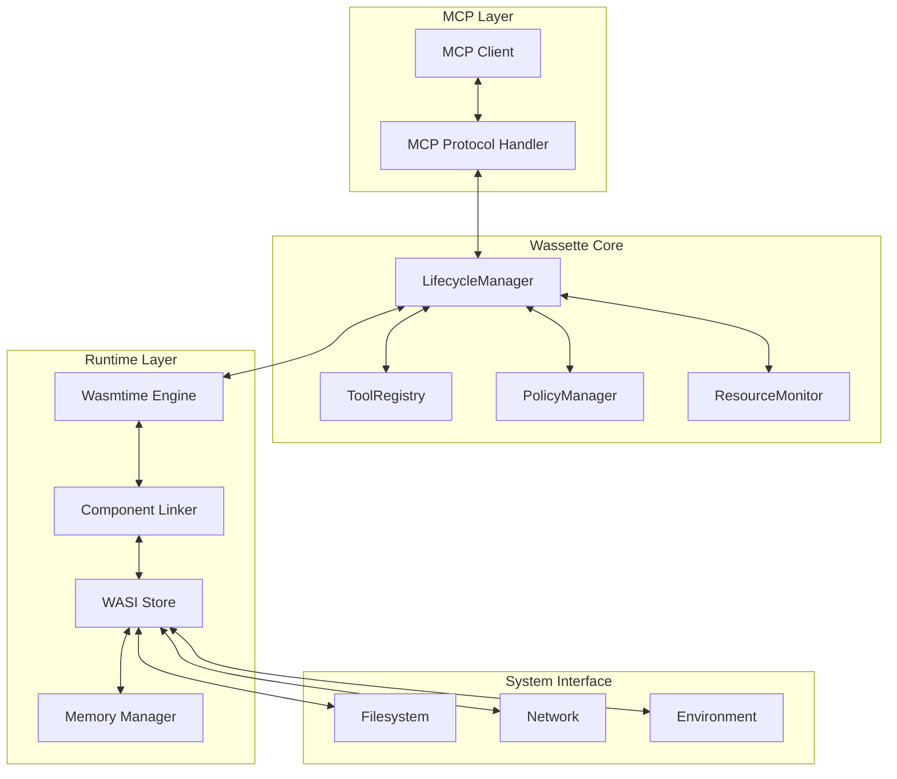

# Runtime Design

Wassette's runtime design balances security, performance, and developer experience through a sophisticated architecture built on WebAssembly Components and the Wasmtime runtime engine. This guide explores the internal design decisions and implementation details.

## Architecture Overview



## Core Runtime Components

### Wasmtime Engine Configuration

The Wasmtime engine is configured for security and performance:

```rust
pub struct RuntimeConfig {
    // Security settings
    pub enable_fuel: bool,
    pub fuel_limit: u64,
    pub memory_limit: u64,
    pub execution_timeout: Duration,
    
    // Performance settings
    pub compilation_strategy: CompilationStrategy,
    pub optimization_level: OptLevel,
    pub enable_parallel_compilation: bool,
    
    // Feature flags
    pub enable_component_model: bool,
    pub enable_async: bool,
    pub enable_wasi_preview2: bool,
}

impl RuntimeConfig {
    pub fn secure_default() -> Self {
        Self {
            // Conservative security defaults
            enable_fuel: true,
            fuel_limit: 1_000_000,
            memory_limit: 64 * 1024 * 1024, // 64MB
            execution_timeout: Duration::from_secs(30),
            
            // Optimized for startup time and security
            compilation_strategy: CompilationStrategy::Auto,
            optimization_level: OptLevel::Speed,
            enable_parallel_compilation: true,
            
            // Enable modern WebAssembly features
            enable_component_model: true,
            enable_async: true,
            enable_wasi_preview2: true,
        }
    }
    
    pub fn create_engine(&self) -> Result<Engine, Error> {
        let mut config = wasmtime::Config::new();
        
        // Security configuration
        config.consume_fuel(self.enable_fuel);
        config.max_wasm_stack(1024 * 1024); // 1MB stack limit
        config.wasm_multi_memory(false); // Single memory for security
        config.wasm_bulk_memory(true);
        config.wasm_simd(true);
        config.wasm_threads(false); // No threads for security
        
        // Component model support
        config.wasm_component_model(self.enable_component_model);
        config.async_support(self.enable_async);
        
        // Performance settings
        config.strategy(self.compilation_strategy)?;
        config.cranelift_opt_level(self.optimization_level);
        config.parallel_compilation(self.enable_parallel_compilation);
        
        Engine::new(&config).map_err(Error::EngineCreation)
    }
}
```

### Component Instantiation

Components are instantiated with careful resource management:

```rust
pub struct ComponentInstance {
    component: Component,
    instance: Instance,
    store: Store<WasiState>,
    resource_limits: ResourceLimits,
    start_time: Instant,
}

impl ComponentInstance {
    pub async fn new(
        engine: &Engine,
        component_bytes: &[u8],
        policy: &ComponentPolicy,
        linker: &Linker<WasiState>,
    ) -> Result<Self, Error> {
        // Compile component
        let component = Component::from_binary(engine, component_bytes)?;
        
        // Create WASI state with policy constraints
        let wasi_state = WasiState::new(policy)?;
        let mut store = Store::new(engine, wasi_state);
        
        // Set resource limits
        let resource_limits = ResourceLimits::from_policy(policy);
        store.set_fuel(resource_limits.fuel_limit)?;
        store.limiter(|state| &mut state.limiter);
        
        // Instantiate component
        let instance = linker.instantiate_async(&mut store, &component).await?;
        
        Ok(Self {
            component,
            instance,
            store,
            resource_limits,
            start_time: Instant::now(),
        })
    }
    
    pub async fn call_function(
        &mut self,
        function_name: &str,
        args: &[Value],
    ) -> Result<Vec<Value>, Error> {
        // Check if we've exceeded execution time
        if self.start_time.elapsed() > self.resource_limits.max_execution_time {
            return Err(Error::ExecutionTimeout);
        }
        
        // Get typed function
        let func = self.instance
            .get_typed_func::<&[Value], Vec<Value>>(&mut self.store, function_name)?;
        
        // Execute with resource monitoring
        let execution_future = func.call_async(&mut self.store, args);
        
        match tokio::time::timeout(
            self.resource_limits.call_timeout,
            execution_future
        ).await {
            Ok(Ok(result)) => {
                // Check resource usage after call
                self.check_resource_usage()?;
                Ok(result)
            }
            Ok(Err(e)) => Err(Error::FunctionCallFailed(e.to_string())),
            Err(_) => Err(Error::CallTimeout),
        }
    }
    
    fn check_resource_usage(&self) -> Result<(), Error> {
        // Check fuel consumption
        let fuel_consumed = self.store.fuel_consumed().unwrap_or(0);
        if fuel_consumed > self.resource_limits.fuel_limit {
            return Err(Error::FuelExhausted);
        }
        
        // Check memory usage
        if let Some(memory) = self.instance.get_memory(&mut self.store, "memory") {
            let memory_size = memory.data_size(&self.store);
            if memory_size > self.resource_limits.max_memory {
                return Err(Error::MemoryLimitExceeded);
            }
        }
        
        Ok(())
    }
}
```

### WASI State Management

WASI state provides controlled system access:

```rust
pub struct WasiState {
    pub filesystem: WasiFilesystem,
    pub network: WasiNetwork,
    pub environment: WasiEnvironment,
    pub clock: WasiClock,
    pub random: WasiRandom,
    pub limiter: ResourceLimiter,
}

impl WasiState {
    pub fn new(policy: &ComponentPolicy) -> Result<Self, Error> {
        Ok(Self {
            filesystem: WasiFilesystem::new(&policy.permissions.storage)?,
            network: WasiNetwork::new(&policy.permissions.network)?,
            environment: WasiEnvironment::new(&policy.permissions.environment)?,
            clock: WasiClock::new(),
            random: WasiRandom::new(),
            limiter: ResourceLimiter::new(&policy.limits),
        })
    }
}

pub struct WasiFilesystem {
    allowed_paths: Vec<PathPermission>,
    open_files: HashMap<u32, FileHandle>,
    next_fd: AtomicU32,
}

impl WasiFilesystem {
    pub fn new(storage_permissions: &StoragePermissions) -> Result<Self, Error> {
        let mut allowed_paths = Vec::new();
        
        for permission in &storage_permissions.allow {
            let path_permission = PathPermission {
                pattern: glob::Pattern::new(&permission.uri)?,
                access: permission.access.clone(),
            };
            allowed_paths.push(path_permission);
        }
        
        Ok(Self {
            allowed_paths,
            open_files: HashMap::new(),
            next_fd: AtomicU32::new(3), // Start after stdin/stdout/stderr
        })
    }
    
    pub fn open_file(&mut self, path: &str, access: FileAccess) -> Result<u32, Error> {
        // Check permissions
        if !self.is_path_allowed(path, access) {
            return Err(Error::PermissionDenied(format!("Access to {} denied", path)));
        }
        
        // Check file limit
        if self.open_files.len() >= self.max_open_files {
            return Err(Error::TooManyOpenFiles);
        }
        
        // Open file
        let file = std::fs::File::open(path)?;
        let fd = self.next_fd.fetch_add(1, Ordering::Relaxed);
        
        let handle = FileHandle {
            file,
            path: path.to_string(),
            access,
            opened_at: Instant::now(),
        };
        
        self.open_files.insert(fd, handle);
        Ok(fd)
    }
    
    fn is_path_allowed(&self, path: &str, requested_access: FileAccess) -> bool {
        for permission in &self.allowed_paths {
            if permission.pattern.matches(path) {
                return permission.access.contains(&requested_access);
            }
        }
        false
    }
}
```

## Memory Management

### Linear Memory Layout

WebAssembly components use linear memory with careful bounds checking:

```rust
pub struct MemoryManager {
    memory: Memory,
    allocator: WasmAllocator,
    heap_base: u32,
    heap_limit: u32,
    allocation_map: BTreeMap<u32, AllocationInfo>,
}

impl MemoryManager {
    pub fn new(memory: Memory, heap_base: u32, heap_limit: u32) -> Self {
        Self {
            memory,
            allocator: WasmAllocator::new(heap_base, heap_limit),
            heap_base,
            heap_limit,
            allocation_map: BTreeMap::new(),
        }
    }
    
    pub fn allocate(&mut self, size: u32, align: u32) -> Result<u32, Error> {
        // Check size limits
        if size > self.heap_limit - self.heap_base {
            return Err(Error::AllocationTooLarge);
        }
        
        // Find suitable memory region
        let ptr = self.allocator.allocate(size, align)?;
        
        // Track allocation
        let allocation = AllocationInfo {
            ptr,
            size,
            alignment: align,
            allocated_at: Instant::now(),
        };
        
        self.allocation_map.insert(ptr, allocation);
        
        Ok(ptr)
    }
    
    pub fn deallocate(&mut self, ptr: u32) -> Result<(), Error> {
        if let Some(allocation) = self.allocation_map.remove(&ptr) {
            self.allocator.deallocate(allocation.ptr, allocation.size)?;
            Ok(())
        } else {
            Err(Error::InvalidPointer(ptr))
        }
    }
    
    pub fn get_memory_stats(&self) -> MemoryStats {
        let total_allocated = self.allocation_map
            .values()
            .map(|a| a.size)
            .sum::<u32>();
        
        MemoryStats {
            heap_base: self.heap_base,
            heap_limit: self.heap_limit,
            total_allocated,
            allocation_count: self.allocation_map.len(),
            fragmentation_ratio: self.calculate_fragmentation(),
        }
    }
    
    fn calculate_fragmentation(&self) -> f32 {
        if self.allocation_map.is_empty() {
            return 0.0;
        }
        
        let total_allocated = self.allocation_map.values().map(|a| a.size).sum::<u32>();
        let heap_used = self.allocator.heap_used();
        
        if heap_used == 0 {
            0.0
        } else {
            1.0 - (total_allocated as f32 / heap_used as f32)
        }
    }
}
```

### Garbage Collection

WebAssembly doesn't have automatic GC, so manual memory management is critical:

```rust
pub struct MemoryGC {
    threshold: u32,
    last_gc: Instant,
    gc_interval: Duration,
}

impl MemoryGC {
    pub fn maybe_collect(&mut self, memory_manager: &mut MemoryManager) -> bool {
        let stats = memory_manager.get_memory_stats();
        
        // Trigger GC if fragmentation is high or memory usage is high
        let should_gc = stats.fragmentation_ratio > 0.3 
            || stats.total_allocated > self.threshold
            || self.last_gc.elapsed() > self.gc_interval;
        
        if should_gc {
            self.collect(memory_manager);
            self.last_gc = Instant::now();
            true
        } else {
            false
        }
    }
    
    fn collect(&self, memory_manager: &mut MemoryManager) {
        // Compact memory by moving allocations
        memory_manager.compact();
        
        // Free unused pages
        memory_manager.free_unused_pages();
    }
}
```

## Security Implementation

### Capability-Based Access Control

Access to system resources is controlled through capabilities:

```rust
pub trait Capability: Send + Sync {
    fn check_permission(&self, operation: &str, resource: &str) -> bool;
    fn grant_permission(&mut self, operation: &str, resource: &str) -> Result<(), Error>;
    fn revoke_permission(&mut self, operation: &str, resource: &str) -> Result<(), Error>;
}

pub struct FileSystemCapability {
    allowed_operations: HashMap<String, HashSet<String>>,
    denied_operations: HashMap<String, HashSet<String>>,
}

impl Capability for FileSystemCapability {
    fn check_permission(&self, operation: &str, resource: &str) -> bool {
        // Check explicit denials first
        if let Some(denied_resources) = self.denied_operations.get(operation) {
            if denied_resources.iter().any(|pattern| self.matches_pattern(pattern, resource)) {
                return false;
            }
        }
        
        // Check explicit allows
        if let Some(allowed_resources) = self.allowed_operations.get(operation) {
            return allowed_resources.iter().any(|pattern| self.matches_pattern(pattern, resource));
        }
        
        // Default deny
        false
    }
    
    fn grant_permission(&mut self, operation: &str, resource: &str) -> Result<(), Error> {
        self.allowed_operations
            .entry(operation.to_string())
            .or_insert_with(HashSet::new)
            .insert(resource.to_string());
        
        Ok(())
    }
    
    fn revoke_permission(&mut self, operation: &str, resource: &str) -> Result<(), Error> {
        if let Some(resources) = self.allowed_operations.get_mut(operation) {
            resources.remove(resource);
        }
        
        Ok(())
    }
}
```

### Sandboxing Enforcement

Multiple layers enforce sandboxing:

```rust
pub struct SandboxEnforcer {
    memory_guard: MemoryGuard,
    call_stack_guard: CallStackGuard,
    resource_guard: ResourceGuard,
}

impl SandboxEnforcer {
    pub fn check_memory_access(&self, ptr: u32, size: u32) -> Result<(), Error> {
        self.memory_guard.check_bounds(ptr, size)?;
        self.memory_guard.check_permissions(ptr, size)?;
        Ok(())
    }
    
    pub fn check_function_call(&self, function_name: &str) -> Result<(), Error> {
        // Check call stack depth
        if self.call_stack_guard.depth() > MAX_CALL_DEPTH {
            return Err(Error::CallStackOverflow);
        }
        
        // Check if function is allowed
        if !self.call_stack_guard.is_function_allowed(function_name) {
            return Err(Error::FunctionNotAllowed(function_name.to_string()));
        }
        
        Ok(())
    }
    
    pub fn check_resource_access(&self, resource_type: ResourceType, resource_id: &str) -> Result<(), Error> {
        self.resource_guard.check_access(resource_type, resource_id)
    }
}

pub struct MemoryGuard {
    valid_ranges: Vec<MemoryRange>,
    read_only_ranges: Vec<MemoryRange>,
}

impl MemoryGuard {
    pub fn check_bounds(&self, ptr: u32, size: u32) -> Result<(), Error> {
        let end = ptr.checked_add(size).ok_or(Error::IntegerOverflow)?;
        
        for range in &self.valid_ranges {
            if ptr >= range.start && end <= range.end {
                return Ok(());
            }
        }
        
        Err(Error::MemoryAccessViolation { ptr, size })
    }
    
    pub fn check_permissions(&self, ptr: u32, size: u32) -> Result<(), Error> {
        let end = ptr.checked_add(size).ok_or(Error::IntegerOverflow)?;
        
        // Check if trying to write to read-only memory
        for range in &self.read_only_ranges {
            if ptr < range.end && end > range.start {
                return Err(Error::WriteToReadOnlyMemory { ptr, size });
            }
        }
        
        Ok(())
    }
}
```

## Performance Optimization

### Compilation Strategy

Components are compiled with optimizations for both startup time and execution speed:

```rust
pub struct CompilationOptimizer {
    cache: CompilationCache,
    profiler: ExecutionProfiler,
}

impl CompilationOptimizer {
    pub fn optimize_component(&self, component: &mut Component) -> Result<(), Error> {
        // Apply ahead-of-time optimizations
        self.apply_aot_optimizations(component)?;
        
        // Apply profile-guided optimizations if available
        if let Some(profile) = self.profiler.get_profile(&component.id) {
            self.apply_pgo_optimizations(component, &profile)?;
        }
        
        Ok(())
    }
    
    fn apply_aot_optimizations(&self, component: &mut Component) -> Result<(), Error> {
        // Dead code elimination
        component.eliminate_dead_code()?;
        
        // Function inlining for small, frequently called functions
        component.inline_functions(&self.get_inline_candidates())?;
        
        // Constant propagation
        component.propagate_constants()?;
        
        // Loop optimizations
        component.optimize_loops()?;
        
        Ok(())
    }
    
    fn apply_pgo_optimizations(&self, component: &mut Component, profile: &ExecutionProfile) -> Result<(), Error> {
        // Optimize based on hot paths
        for hot_function in &profile.hot_functions {
            component.optimize_function(hot_function, OptimizationLevel::Aggressive)?;
        }
        
        // Optimize branch prediction
        component.optimize_branches(&profile.branch_frequencies)?;
        
        Ok(())
    }
}
```

### Caching Strategy

Multiple levels of caching improve performance:

```rust
pub struct RuntimeCache {
    component_cache: LruCache<ComponentId, CompiledComponent>,
    instance_pool: InstancePool,
    execution_cache: LruCache<ExecutionKey, ExecutionResult>,
}

impl RuntimeCache {
    pub fn get_or_compile_component(&mut self, component_id: &ComponentId, bytes: &[u8]) -> Result<&CompiledComponent, Error> {
        if let Some(component) = self.component_cache.get(component_id) {
            return Ok(component);
        }
        
        // Compile component
        let compiled = self.compile_component(bytes)?;
        
        // Cache compiled component
        self.component_cache.put(component_id.clone(), compiled);
        
        Ok(self.component_cache.get(component_id).unwrap())
    }
    
    pub fn get_or_create_instance(&mut self, component_id: &ComponentId) -> Result<ComponentInstance, Error> {
        // Try to get recycled instance from pool
        if let Some(instance) = self.instance_pool.get(component_id) {
            instance.reset()?;
            return Ok(instance);
        }
        
        // Create new instance
        let component = self.component_cache.get(component_id).ok_or(Error::ComponentNotFound)?;
        let instance = self.create_instance(component)?;
        
        Ok(instance)
    }
    
    pub fn return_instance(&mut self, instance: ComponentInstance) {
        // Return instance to pool for reuse
        self.instance_pool.return_instance(instance);
    }
}

pub struct InstancePool {
    pools: HashMap<ComponentId, VecDeque<ComponentInstance>>,
    max_pool_size: usize,
}

impl InstancePool {
    pub fn get(&mut self, component_id: &ComponentId) -> Option<ComponentInstance> {
        self.pools.get_mut(component_id)?.pop_front()
    }
    
    pub fn return_instance(&mut self, instance: ComponentInstance) {
        let component_id = instance.component_id().clone();
        let pool = self.pools.entry(component_id).or_insert_with(VecDeque::new);
        
        if pool.len() < self.max_pool_size {
            pool.push_back(instance);
        }
        // Instance is dropped if pool is full
    }
}
```

## Error Handling and Recovery

### Fault Isolation

Errors in one component don't affect others:

```rust
pub struct FaultIsolation {
    component_states: HashMap<ComponentId, ComponentHealth>,
    global_health: SystemHealth,
}

impl FaultIsolation {
    pub fn handle_component_error(&mut self, component_id: &ComponentId, error: &Error) {
        let health = self.component_states.entry(component_id.clone())
            .or_insert_with(ComponentHealth::new);
        
        health.record_error(error);
        
        // Check if component should be quarantined
        if health.should_quarantine() {
            self.quarantine_component(component_id);
        }
        
        // Update global health
        self.global_health.update_component_health(component_id, health);
    }
    
    fn quarantine_component(&mut self, component_id: &ComponentId) {
        warn!("Quarantining component {} due to repeated failures", component_id);
        
        // Mark component as unhealthy
        if let Some(health) = self.component_states.get_mut(component_id) {
            health.quarantine();
        }
        
        // Unload all instances
        self.unload_all_instances(component_id);
    }
    
    pub fn is_component_healthy(&self, component_id: &ComponentId) -> bool {
        self.component_states.get(component_id)
            .map(|health| health.is_healthy())
            .unwrap_or(true)
    }
}

pub struct ComponentHealth {
    error_count: u32,
    last_error: Option<Instant>,
    consecutive_errors: u32,
    is_quarantined: bool,
}

impl ComponentHealth {
    pub fn record_error(&mut self, error: &Error) {
        self.error_count += 1;
        
        if self.last_error.map(|t| t.elapsed() < Duration::from_secs(60)).unwrap_or(false) {
            self.consecutive_errors += 1;
        } else {
            self.consecutive_errors = 1;
        }
        
        self.last_error = Some(Instant::now());
    }
    
    pub fn should_quarantine(&self) -> bool {
        self.consecutive_errors > 5 || self.error_count > 50
    }
    
    pub fn is_healthy(&self) -> bool {
        !self.is_quarantined && self.consecutive_errors < 3
    }
}
```

## Debugging and Observability

### Runtime Instrumentation

The runtime is instrumented for observability:

```rust
pub struct RuntimeInstrumentation {
    metrics: RuntimeMetrics,
    tracer: RuntimeTracer,
    profiler: RuntimeProfiler,
}

impl RuntimeInstrumentation {
    pub fn record_component_load(&self, component_id: &ComponentId, duration: Duration) {
        self.metrics.component_loads.inc();
        self.metrics.load_duration.observe(duration.as_secs_f64());
        
        self.tracer.trace_event(TraceEvent::ComponentLoaded {
            component_id: component_id.clone(),
            duration,
        });
    }
    
    pub fn record_function_call(&self, component_id: &ComponentId, function: &str, duration: Duration, result: &Result<Value, Error>) {
        self.metrics.function_calls.inc();
        self.metrics.call_duration.observe(duration.as_secs_f64());
        
        match result {
            Ok(_) => self.metrics.successful_calls.inc(),
            Err(_) => self.metrics.failed_calls.inc(),
        }
        
        self.tracer.trace_event(TraceEvent::FunctionCalled {
            component_id: component_id.clone(),
            function: function.to_string(),
            duration,
            success: result.is_ok(),
        });
        
        self.profiler.record_execution(component_id, function, duration);
    }
}
```

## Next Steps

- Explore [Component Lifecycle](./component-lifecycle.md) for detailed lifecycle management
- Learn about [System Architecture](../design/architecture.md) for high-level design
- Review [Security Model](../security/security-model.md) for security implementation details
- Check [Performance Optimization](../cookbook/common-patterns.md#performance) for optimization techniques