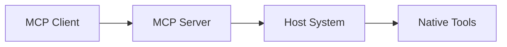
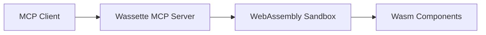

# MCP Fundamentals

The Model Context Protocol (MCP) is an open standard that enables AI assistants to securely access external data and tools. Understanding MCP is essential for working with Wassette effectively.

## What is MCP?

MCP defines a standardized way for AI assistants (like ChatGPT, Claude, or Gemini) to interact with external tools and data sources. It establishes clear boundaries between:

- **MCP Clients**: AI assistants or applications that need access to tools and data
- **MCP Servers**: Applications that provide tools, resources, and prompts to clients

## Core MCP Concepts

### MCP Servers vs MCP Clients

**MCP Server** (like Wassette):
- Provides tools, resources, and prompts to clients
- Handles authentication and authorization
- Manages the actual execution of tool functions
- Responds to client requests in standard MCP format

**MCP Client** (like VS Code, Cursor, Claude Code):
- Connects to MCP servers to access their capabilities
- Discovers available tools and resources
- Makes requests to servers on behalf of users
- Handles user interaction and response formatting

### Tools

**Tools** are functions that MCP servers expose to clients. They represent actions that can be performed:

- **Input**: JSON schema defining expected parameters
- **Output**: Structured results or errors
- **Examples**: File operations, API calls, calculations, data processing

```json
{
  "name": "read_file",
  "description": "Read the contents of a file",
  "inputSchema": {
    "type": "object",
    "properties": {
      "path": {"type": "string", "description": "File path to read"}
    },
    "required": ["path"]
  }
}
```

### Resources

**Resources** are data sources that MCP servers can provide to clients:

- **Static content**: Configuration files, documentation, templates
- **Dynamic content**: Database queries, API responses, computed values
- **Streaming content**: Log files, real-time data feeds

### Prompts

**Prompts** are reusable templates that clients can use to interact with users:

- **Template variables**: Parameterized prompts for different contexts
- **Context injection**: Include relevant resources or tool outputs
- **Standardization**: Consistent interaction patterns across tools

## How Wassette Fits into MCP

Wassette is an **MCP server** that takes a unique approach to tool execution:

### Traditional MCP Servers


### Wassette MCP Server


### Key Differences

| Aspect | Traditional MCP Server | Wassette MCP Server |
|--------|----------------------|-------------------|
| **Tool Execution** | Direct host execution | WebAssembly sandbox |
| **Security** | Host privileges | Capability-based permissions |
| **Isolation** | Process-level | Memory-safe sandbox |
| **Distribution** | Language-specific packages | OCI artifacts |
| **Policies** | Configuration files | Per-component policies |

## MCP Transport Methods

MCP supports multiple transport methods for client-server communication:

### Standard I/O (stdio)
```bash
wassette serve --stdio
```
- Most common transport method
- Uses stdin/stdout for communication
- Standard for local MCP servers

### Server-Sent Events (SSE)
```bash
wassette serve --sse
```
- HTTP-based transport with streaming
- Useful for web-based clients
- Enables real-time updates

### HTTP
```bash
wassette serve --http
```
- RESTful API transport
- Good for integration scenarios
- Standard HTTP request/response

## MCP Tool Discovery and Execution

When an MCP client connects to Wassette, the following happens:

1. **Handshake**: Client and server negotiate capabilities
2. **Discovery**: Client requests available tools from server
3. **Schema Exchange**: Server provides tool schemas (inputs/outputs)
4. **Execution**: Client calls tools with parameters
5. **Results**: Server returns structured responses

### Example Tool Call Flow

```json
// 1. Client discovers tools
{
  "jsonrpc": "2.0",
  "method": "tools/list",
  "id": 1
}

// 2. Server responds with available tools
{
  "jsonrpc": "2.0",
  "id": 1,
  "result": {
    "tools": [
      {
        "name": "read_file",
        "description": "Read file contents",
        "inputSchema": { /* schema */ }
      }
    ]
  }
}

// 3. Client calls a tool
{
  "jsonrpc": "2.0",
  "method": "tools/call",
  "id": 2,
  "params": {
    "name": "read_file",
    "arguments": {"path": "/tmp/example.txt"}
  }
}

// 4. Server executes and responds
{
  "jsonrpc": "2.0",
  "id": 2,
  "result": {
    "content": [
      {
        "type": "text",
        "text": "File contents here..."
      }
    ]
  }
}
```

## Benefits of MCP with Wassette

### For Users
- **Familiar workflow**: Tools work exactly like traditional MCP tools
- **Enhanced security**: Tools run in isolated sandboxes with explicit permissions
- **Transparency**: Clear visibility into what tools can access

### For Developers
- **Standard interface**: Build tools using familiar MCP patterns
- **Language flexibility**: Use any language that compiles to WebAssembly
- **Security by default**: Capabilities must be explicitly granted

### For Organizations
- **Audit trail**: All tool capabilities are explicitly declared
- **Policy control**: Fine-grained security policies per tool
- **Supply chain security**: Signed components from trusted registries

## Next Steps

- Learn about [WebAssembly Components](./webassembly-components.md) and how they work
- Understand [Policy & Capabilities](./policy-capabilities.md) for security control
- Explore the [System Architecture](../architecture/system-architecture.md) to see how it all fits together