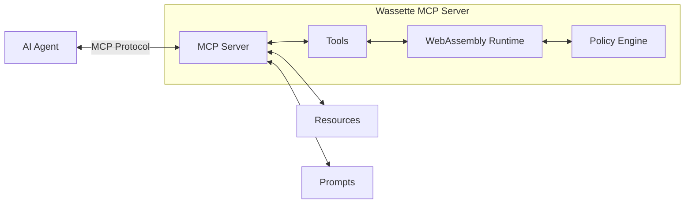
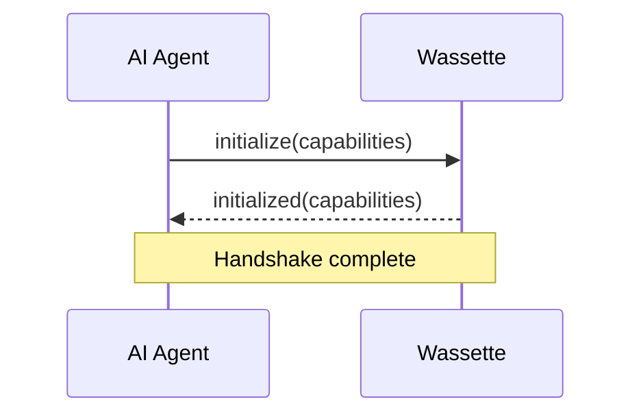
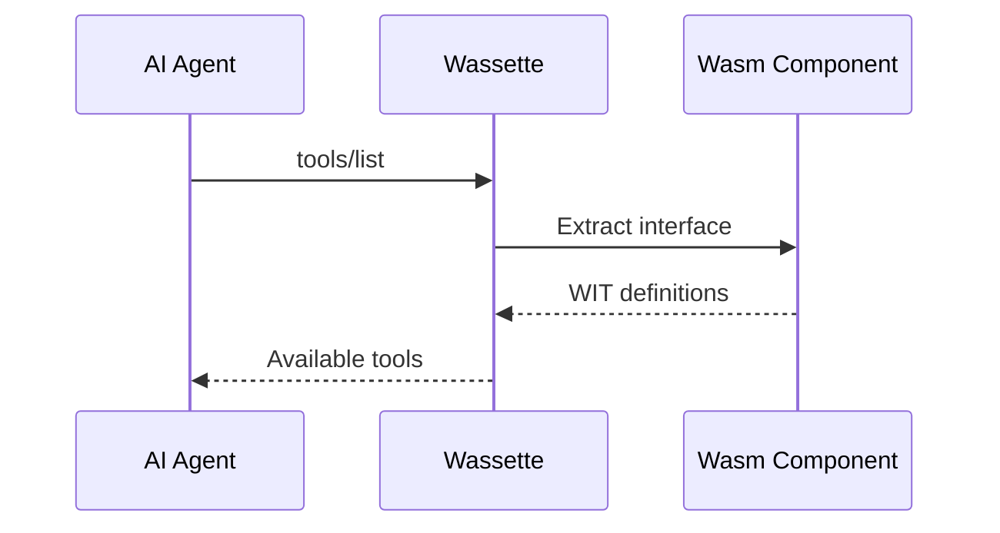
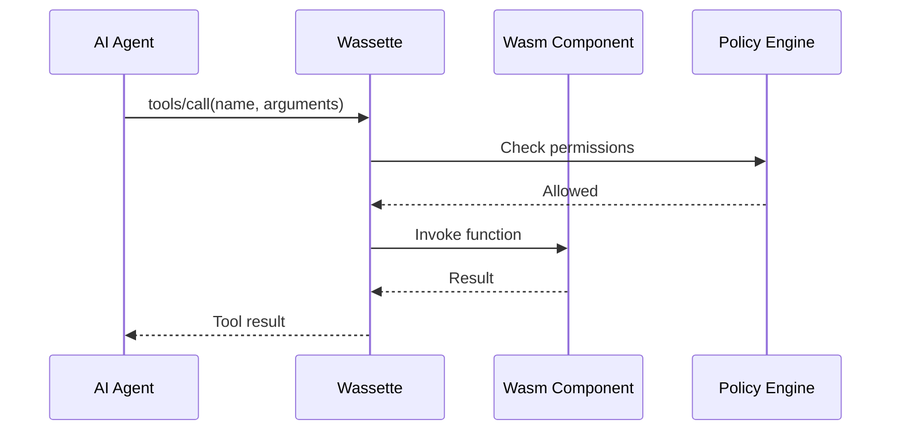

# Model Context Protocol (MCP)

The Model Context Protocol (MCP) is an open standard that enables AI language models to securely access and interact with external tools, data sources, and services. Wassette implements MCP to provide AI agents with access to WebAssembly components as tools.

## What is MCP?

MCP defines a standardized way for AI agents to:

- **Discover** available tools and their capabilities
- **Call** functions with type-safe parameters
- **Access** external data sources and resources
- **Interact** with services in a controlled manner

### MCP vs Other Integration Methods

| Integration Method | Type Safety | Security | Discoverability | Performance |
|-------------------|-------------|----------|-----------------|-------------|
| Direct API calls | Limited | Manual | Manual | Network-bound |
| Function calling | Schema-based | Manual | Manual | Network-bound |
| **MCP** | **Full** | **Built-in** | **Automatic** | **Local/Remote** |

## MCP Architecture



### Components

1. **MCP Client**: The AI agent that consumes tools
2. **MCP Server**: Wassette, which provides tools
3. **Transport**: Communication layer (stdio, SSE, WebSocket)
4. **Protocol**: JSON-RPC 2.0 based message format

## MCP Capabilities in Wassette

### Tools

**Tools** are functions that AI agents can call to perform actions or retrieve information.

```json
{
  "method": "tools/list",
  "result": {
    "tools": [
      {
        "name": "get-weather",
        "description": "Get current weather for a location",
        "inputSchema": {
          "type": "object",
          "properties": {
            "location": {"type": "string"}
          },
          "required": ["location"]
        }
      }
    ]
  }
}
```

In Wassette, each WebAssembly component function becomes an MCP tool automatically.

### Resources

**Resources** represent data sources that can be read or updated by AI agents.

```json
{
  "method": "resources/list", 
  "result": {
    "resources": [
      {
        "uri": "config://api-keys",
        "name": "API Configuration",
        "description": "Stored API keys and configuration",
        "mimeType": "application/json"
      }
    ]
  }
}
```

Wassette provides resources for:
- Component configurations
- Permission policies
- Component metadata

### Prompts

**Prompts** are templates that help AI agents generate better responses.

```json
{
  "method": "prompts/list",
  "result": {
    "prompts": [
      {
        "name": "component-troubleshooting", 
        "description": "Help debug component issues",
        "arguments": [
          {
            "name": "component_id",
            "description": "ID of the component to troubleshoot"
          }
        ]
      }
    ]
  }
}
```

## MCP Protocol Flow

### 1. Initialization



### 2. Tool Discovery



### 3. Tool Execution



## Transport Layers

MCP supports multiple transport mechanisms:

### Standard I/O (stdio)

Most common for local development:

```bash
wassette serve --stdio
```

**Pros:**
- Simple setup
- Works with all MCP clients
- No network configuration needed

**Cons:**
- Local only
- Limited scalability

### Server-Sent Events (SSE)

Best for web-based clients:

```bash
wassette serve --sse --port 8080
```

**Pros:**
- Web-compatible
- Real-time updates
- HTTP-based

**Cons:**
- One-way communication
- Requires HTTP server

### WebSocket

For real-time bidirectional communication:

```bash
wassette serve --websocket --port 8080
```

**Pros:**
- Real-time bidirectional
- Low latency
- Connection-oriented

**Cons:**
- More complex setup
- Connection management

## Error Handling

MCP defines standard error codes and formats:

### Error Response Format

```json
{
  "error": {
    "code": -32602,
    "message": "Invalid params",
    "data": {
      "details": "Missing required parameter 'location'"
    }
  }
}
```

### Common Error Codes

| Code | Name | Description |
|------|------|-------------|
| -32700 | Parse error | Invalid JSON |
| -32600 | Invalid request | Request not conforming to spec |
| -32601 | Method not found | Tool/method doesn't exist |
| -32602 | Invalid params | Invalid parameters provided |
| -32603 | Internal error | Server-side error |

### Wassette-Specific Errors

```json
{
  "error": {
    "code": -32001,
    "message": "Component permission denied",
    "data": {
      "component_id": "weather-tool",
      "permission": "network:api.openweathermap.org",
      "reason": "Host not in allowlist"
    }
  }
}
```

## Security Model

MCP in Wassette implements multiple security layers:

### Protocol Security

- **Authentication**: Optional client authentication
- **Authorization**: Per-tool access control
- **Encryption**: TLS for network transports
- **Validation**: Input validation and sanitization

### Component Security

- **Sandboxing**: WebAssembly sandbox isolation
- **Permissions**: Capability-based access control
- **Resource Limits**: Memory and CPU constraints
- **Audit Logging**: Comprehensive operation logging

## Best Practices

### For AI Agent Developers

1. **Handle Errors Gracefully**: Always check for error responses
2. **Validate Schemas**: Use provided JSON schemas for validation
3. **Respect Rate Limits**: Don't overwhelm the server
4. **Cache Tool Lists**: Avoid repeated discovery calls

### For Tool Developers

1. **Clear Descriptions**: Provide helpful tool descriptions
2. **Rich Schemas**: Use detailed JSON schemas for parameters
3. **Error Messages**: Return actionable error messages
4. **Idempotency**: Make tools safe to call multiple times

### For Platform Operators

1. **Monitor Usage**: Track tool calls and performance
2. **Set Limits**: Configure appropriate resource limits
3. **Log Everything**: Enable comprehensive logging
4. **Update Regularly**: Keep components and policies current

## Debugging MCP Interactions

### MCP Inspector

Use the official MCP inspector for debugging:

```bash
# Connect to Wassette
npx @modelcontextprotocol/inspector --cli http://localhost:8080/sse

# List available tools
npx @modelcontextprotocol/inspector --cli http://localhost:8080/sse --method tools/list

# Call a tool
npx @modelcontextprotocol/inspector --cli http://localhost:8080/sse \
  --method tools/call --tool-name get-weather \
  --tool-arg location=Seattle
```

### Logging

Enable detailed MCP logging:

```bash
# Enable debug logging
RUST_LOG=debug wassette serve --stdio

# Enable trace logging for MCP protocol
RUST_LOG=wassette::mcp=trace wassette serve --stdio
```

### Common Issues

1. **Tool Not Found**: Component not loaded or function not exported
2. **Permission Denied**: Component lacks required permissions
3. **Invalid Parameters**: Arguments don't match schema
4. **Timeout**: Component execution taking too long

## Advanced Features

### Dynamic Tool Registration

Components can register tools at runtime:

```rust
// In component code
#[export]
fn register_dynamic_tool(name: String, schema: String) -> Result<(), String> {
    // Register new tool with provided schema
    host::register_tool(&name, &schema)
}
```

### Resource Streaming

Large resources can be streamed:

```json
{
  "method": "resources/read",
  "params": {
    "uri": "data://large-dataset",
    "range": {
      "start": 0,
      "length": 1024
    }
  }
}
```

### Batch Operations

Multiple tool calls in a single request:

```json
{
  "method": "tools/batch",
  "params": {
    "calls": [
      {"name": "get-weather", "arguments": {"location": "Seattle"}},
      {"name": "get-weather", "arguments": {"location": "Portland"}}
    ]
  }
}
```

## Integration Examples

### Claude Desktop

```json
{
  "mcpServers": {
    "wassette": {
      "command": "wassette",
      "args": ["serve", "--stdio"],
      "env": {
        "RUST_LOG": "info"
      }
    }
  }
}
```

### VS Code Extension

```javascript
const client = new MCPClient({
  transport: new StdioTransport('wassette', ['serve', '--stdio'])
});

await client.connect();
const tools = await client.listTools();
```

### Custom Integration

```python
import json
import subprocess

class WassetteClient:
    def __init__(self):
        self.process = subprocess.Popen(
            ['wassette', 'serve', '--stdio'],
            stdin=subprocess.PIPE,
            stdout=subprocess.PIPE,
            text=True
        )
    
    def call_tool(self, name, arguments):
        request = {
            "jsonrpc": "2.0",
            "id": 1,
            "method": "tools/call",
            "params": {
                "name": name,
                "arguments": arguments
            }
        }
        
        self.process.stdin.write(json.dumps(request) + '\n')
        self.process.stdin.flush()
        
        response = json.loads(self.process.stdout.readline())
        return response
```

## Next Steps

- Learn about [Core Concepts](./core-concepts.md)
- Understand [WebAssembly Components](./wasm-components.md)
- Explore [Security Model](../security/security-model.md)
- Start [building tools](../development/getting-started.md)