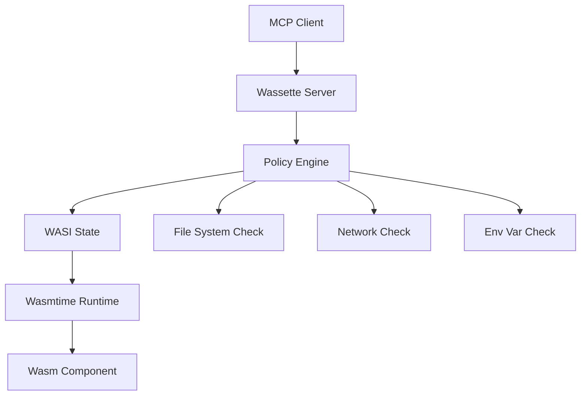

# Policy & Capabilities

Wassette's security model is built on capability-based access control, where WebAssembly components must explicitly declare and be granted permissions for any system resources they need to access.

## Capability-Based Security

Traditional applications run with the full privileges of the user account. Wassette components start with **zero capabilities** and must be explicitly granted permissions for:

- **Filesystem access**: Read/write specific files or directories
- **Network access**: Connect to specific hosts and ports
- **Environment variables**: Access to configuration and secrets
- **System resources**: Process execution, system information

## Default Security Posture

When a component is loaded without a policy, it has **no access** to:

- File system (cannot read or write any files)
- Network (cannot make outbound connections)
- Environment variables (cannot access any configuration)
- System calls (limited to basic WebAssembly operations)

This "secure by default" approach means that components can only perform computation on data explicitly provided to them.

## Policy Files

Policies are defined in YAML files that specify exactly what a component is allowed to access:

```yaml
version: "1.0"
description: "Policy for file processing tool"
permissions:
  storage:
    allow:
      - uri: "fs:///workspace/**"
        access: ["read", "write"]
      - uri: "fs:///config/app.yaml"
        access: ["read"]
  network:
    allow:
      - host: "api.example.com"
        port: 443
      - host: "cdn.assets.com"
  environment:
    allow:
      - key: "API_KEY"
      - key: "CONFIG_URL"
```

## Permission Types

### Storage Permissions

Control filesystem access with granular path and operation control:

```yaml
permissions:
  storage:
    allow:
      # Read-write access to workspace directory and subdirectories
      - uri: "fs:///workspace/**"
        access: ["read", "write"]
      
      # Read-only access to specific configuration file
      - uri: "fs:///config/settings.json"
        access: ["read"]
      
      # Write-only access to logs directory
      - uri: "fs:///var/logs/**"
        access: ["write"]
    
    deny:
      # Explicitly deny access to sensitive directories
      - uri: "fs:///home/**/.ssh/**"
      - uri: "fs:///etc/passwd"
```

**URI Patterns:**
- `fs:///path/to/file` - Exact file path
- `fs:///path/to/dir/**` - Directory and all subdirectories
- `fs:///path/to/dir/*` - Direct children only
- `fs://workspace/data.txt` - Relative to workspace root

**Access Types:**
- `read` - Read file contents, check file existence
- `write` - Create, modify, or delete files
- `execute` - Execute files (where supported)

### Network Permissions

Control outbound network connections:

```yaml
permissions:
  network:
    allow:
      # HTTPS API access
      - host: "api.openai.com"
        port: 443
        protocol: "https"
      
      # Any port on specific host
      - host: "internal.company.com"
      
      # Wildcard subdomain access
      - host: "*.cdn.example.com"
        port: 443
    
    deny:
      # Block access to internal networks
      - host: "10.*.*.*"
      - host: "192.168.*.*"
```

**Network Properties:**
- `host` - Hostname or IP address (supports wildcards)
- `port` - Specific port number (optional, defaults to any)
- `protocol` - http, https, tcp, udp (optional)

### Environment Variable Permissions

Control access to environment variables:

```yaml
permissions:
  environment:
    allow:
      # Specific variables
      - key: "API_KEY"
      - key: "DATABASE_URL"
      
      # Pattern matching
      - key: "APP_*"  # All variables starting with APP_
    
    deny:
      # Sensitive system variables
      - key: "PATH"
      - key: "HOME"
```

## Policy Application

### Component-Specific Policies

Each component can have its own policy file:

```bash
# Load component with co-located policy
wassette component load file:///path/to/component.wasm
# Automatically looks for component.policy.yaml

# Explicit policy file
wassette component load file:///path/to/component.wasm --policy file:///path/to/custom.policy.yaml
```

### Runtime Policy Management

Policies can be managed at runtime using built-in MCP tools:

```bash
# Attach a policy from URL
wassette policy attach my-component https://policies.example.com/file-processor.yaml

# Grant additional storage permission
wassette permission grant storage my-component fs:///data/** --access read,write

# Revoke network permission
wassette permission revoke network my-component api.example.com

# View current policy
wassette policy get my-component
```

### Policy Inheritance

Components can inherit from base policies:

```yaml
version: "1.0"
extends: "base://filesystem-tool"  # Inherit from base policy
description: "Extended file processor"
permissions:
  storage:
    allow:
      # Additional permissions beyond base policy
      - uri: "fs:///special-data/**"
        access: ["read"]
```

## Policy Validation

Policies are validated when applied:

### Schema Validation
```bash
# Check policy syntax and structure
wassette policy validate policy.yaml
```

### Capability Analysis
```bash
# Analyze what a component can access
wassette policy analyze my-component

# Output example:
# Storage Access:
#   - Read: /workspace/*, /config/app.yaml
#   - Write: /workspace/*, /logs/*
# Network Access:
#   - HTTPS: api.example.com:443
# Environment: API_KEY, CONFIG_URL
```

## Security Boundaries

### What Policies Cannot Override

Certain security boundaries are enforced by the WebAssembly runtime itself and cannot be bypassed by policies:

- **Memory isolation**: Components cannot access each other's memory
- **Type safety**: Function calls are validated at the interface level
- **Resource limits**: CPU and memory usage are bounded by the runtime
- **System calls**: Only WASI-approved system calls are available

### Policy Enforcement Points



## Example Policies

### Minimal File Reader

```yaml
version: "1.0"
description: "Read-only file access tool"
permissions:
  storage:
    allow:
      - uri: "fs:///workspace/**"
        access: ["read"]
```

### API Client Tool

```yaml
version: "1.0"
description: "External API integration"
permissions:
  network:
    allow:
      - host: "api.service.com"
        port: 443
        protocol: "https"
  environment:
    allow:
      - key: "API_TOKEN"
  storage:
    allow:
      - uri: "fs:///tmp/cache/**"
        access: ["read", "write"]
```

### Data Processing Pipeline

```yaml
version: "1.0"
description: "Multi-stage data processor"
permissions:
  storage:
    allow:
      - uri: "fs:///input/**"
        access: ["read"]
      - uri: "fs:///output/**"
        access: ["write"]
      - uri: "fs:///temp/**"
        access: ["read", "write"]
    deny:
      - uri: "fs:///input/**/private/**"
  network:
    allow:
      - host: "validation.service.com"
      - host: "metrics.internal.com"
        port: 8080
  environment:
    allow:
      - key: "STAGE"
      - key: "PROCESSING_*"
```

## Policy Best Practices

### Principle of Least Privilege
- Start with minimal permissions
- Add permissions only as needed
- Regularly audit and remove unused permissions

### Path Specificity
```yaml
# Good: Specific paths
- uri: "fs:///workspace/data/**"

# Avoid: Overly broad access
- uri: "fs:///**"
```

### Network Restrictions
```yaml
# Good: Specific hosts and protocols
- host: "api.example.com"
  port: 443
  protocol: "https"

# Avoid: Unrestricted network access
- host: "*"
```

### Environment Variable Control
```yaml
# Good: Specific variables
- key: "API_KEY"
- key: "DATABASE_URL"

# Avoid: Wildcard access to all variables
- key: "*"
```

## Troubleshooting Policies

### Common Permission Errors

**File Access Denied:**
```
Error: Permission denied: Cannot access fs:///data/file.txt
```
Solution: Add storage permission for the path.

**Network Connection Refused:**
```
Error: Network access denied: api.example.com:443
```
Solution: Add network permission for the host.

**Environment Variable Not Found:**
```
Error: Environment variable 'API_KEY' not accessible
```
Solution: Add environment permission for the variable.

### Policy Debugging

```bash
# Check effective permissions
wassette policy get my-component --effective

# Test permission before applying
wassette policy test policy.yaml --path /workspace/test.txt --action read

# Audit policy usage
wassette policy audit my-component --show-unused
```

## Advanced Policy Features

### Conditional Permissions

```yaml
permissions:
  storage:
    allow:
      - uri: "fs:///logs/**"
        access: ["write"]
        conditions:
          - environment: "production"
          - time-range: "09:00-17:00"
```

### Policy Templates

```yaml
version: "1.0"
template: true
parameters:
  - name: "workspace_path"
    type: "string"
    default: "/workspace"
permissions:
  storage:
    allow:
      - uri: "fs://{{ workspace_path }}/**"
        access: ["read", "write"]
```

### Policy Composition

```yaml
version: "1.0"
compose:
  - "base://filesystem-tool"
  - "base://network-client"
overrides:
  storage:
    deny:
      - uri: "fs:///sensitive/**"
```

## Next Steps

- Learn about [System Architecture](../architecture/system-architecture.md) to understand how policies fit into the overall system
- Explore [Security & Sandboxing](../security/sandboxing-overview.md) for deeper security concepts
- Check out [Policy Schema Reference](../reference/policy-schema.md) for complete syntax documentation