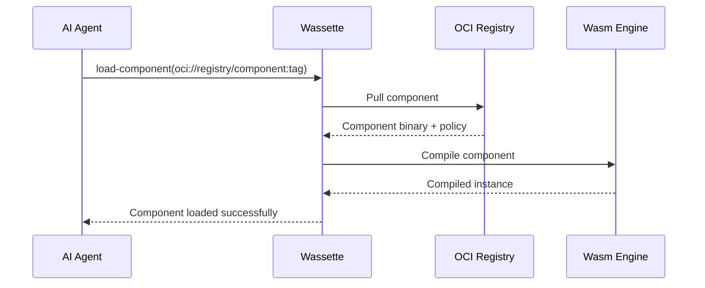

# WebAssembly Components

WebAssembly Components represent the next evolution of WebAssembly, providing a high-level abstraction for building secure, portable, and composable tools. This guide explains what components are, how they work, and why they're perfect for AI agent tools.

## What are WebAssembly Components?

WebAssembly Components are a standardized way to package and distribute WebAssembly code with rich interfaces. Unlike traditional WebAssembly modules, components provide:

- **High-level interfaces** using WIT (WebAssembly Interface Types)
- **Type safety** with automatic marshalling between host and component
- **Composition** allowing components to use other components
- **Portability** across different hosts and platforms

## Component Model Benefits

### For Tool Developers

- **Focus on Logic**: Write business logic without worrying about infrastructure
- **Language Choice**: Use any language that compiles to WebAssembly
- **Type Safety**: Rich type system prevents common errors
- **Easy Testing**: Components can be tested in isolation

### For AI Agents

- **Security**: Components run in a sandbox with explicit permissions
- **Discovery**: Automatic tool discovery from component interfaces
- **Reliability**: Memory-safe execution prevents crashes
- **Performance**: Near-native execution speed

### For Platform Operators

- **Control**: Fine-grained permission system
- **Monitoring**: Comprehensive logging and metrics
- **Deployment**: Simple component distribution via registries
- **Maintenance**: Easy updates without downtime

## Component Structure

A WebAssembly component consists of several parts:

### 1. WebAssembly Core Module

The compiled code containing the actual implementation:

```
my-component.wasm
├── Code Section (compiled functions)
├── Memory Section (linear memory)
├── Custom Sections (metadata)
└── Component Section (component metadata)
```

### 2. WIT Interface Definition

The interface specification in WIT format:

```wit
package my-component:tools@1.0.0;

/// Weather information retrieval
interface weather {
  /// Current weather conditions
  record weather-info {
    temperature: f32,
    humidity: u8,
    description: string,
  }

  /// Get current weather for a location
  get-weather: func(location: string) -> result<weather-info, string>;
}

world weather-tool {
  export weather;
}
```

### 3. Policy Configuration

Security policy defining permissions:

```yaml
version: "1.0"
description: "Weather API component"
permissions:
  network:
    allow:
      - host: "api.openweathermap.org"
  environment:
    allow:
      - key: "WEATHER_API_KEY"
```

## Component Lifecycle in Wassette

### 1. Component Loading



### 2. Interface Extraction

When a component is loaded, Wassette:

1. **Parses WIT**: Extracts interface definitions
2. **Generates Schema**: Creates JSON Schema for MCP
3. **Maps Functions**: Associates component exports with MCP tools
4. **Validates Types**: Ensures type compatibility

### 3. Tool Registration

Each exported function becomes an MCP tool:

```json
{
  "name": "get-weather",
  "description": "Get current weather for a location", 
  "inputSchema": {
    "type": "object",
    "properties": {
      "location": {
        "type": "string",
        "description": "Location to get weather for"
      }
    },
    "required": ["location"]
  }
}
```

### 4. Execution

When an AI agent calls a tool:

1. **Instance Creation**: New WebAssembly instance with fresh state
2. **Permission Setup**: Apply security policies and resource limits
3. **Function Call**: Invoke component function with arguments
4. **Result Handling**: Convert WebAssembly results to JSON
5. **Cleanup**: Dispose of instance and free resources

## WIT Type System

WIT provides a rich type system for defining component interfaces:

### Primitive Types

```wit
// Basic types
bool-value: bool;
integer-value: s32;
float-value: f64;
text-value: string;
```

### Composite Types

```wit
// Records (like structs)
record user {
  id: u32,
  name: string,
  email: option<string>,
}

// Variants (like enums)
variant status {
  pending,
  success(string),
  error(string),
}

// Lists
list<string>
```

### Advanced Types

```wit
// Results for error handling
result<success-type, error-type>

// Options for nullable values
option<string>

// Resources for stateful objects
resource file-handle {
  read: func() -> list<u8>;
  write: func(data: list<u8>);
}
```

## Component Composition

Components can import functionality from other components:

### Example: File Processing Component

```wit
// Import file system operations
import filesystem:api/file-operations;

// Import JSON processing  
import json:api/parser;

interface processor {
  process-file: func(path: string) -> result<string, string>;
}

world file-processor {
  import filesystem:api/file-operations;
  import json:api/parser;
  export processor;
}
```

### Benefits of Composition

- **Reusability**: Share common functionality across components
- **Modularity**: Build complex tools from simple building blocks
- **Security**: Each component maintains its own permission boundary
- **Testing**: Test components in isolation

## Language Support

Components can be built in any language that compiles to WebAssembly:

### Currently Supported

- **JavaScript/TypeScript**: Using [`jco`](https://github.com/bytecodealliance/jco)
- **Rust**: Using [`cargo-component`](https://github.com/bytecodealliance/cargo-component)
- **Python**: Using [`componentize-py`](https://github.com/bytecodealliance/componentize-py)
- **Go**: Using [`TinyGo`](https://tinygo.org/) with component tools

### Language Comparison

| Language | Maturity | Performance | Ecosystem | Learning Curve |
|----------|----------|-------------|-----------|----------------|
| Rust | High | Excellent | Rich | Moderate |
| JavaScript | High | Good | Excellent | Low |
| Python | Medium | Good | Rich | Low |
| Go | Medium | Good | Good | Low |

## Best Practices

### Interface Design

1. **Keep it Simple**: Start with simple interfaces and evolve
2. **Use Rich Types**: Leverage WIT's type system for safety
3. **Document Everything**: Include descriptions for all functions and types
4. **Version Carefully**: Plan for interface evolution

### Implementation

1. **Error Handling**: Always return proper error types
2. **Input Validation**: Validate all inputs from the host
3. **Resource Cleanup**: Properly dispose of resources
4. **Testing**: Write comprehensive tests for component logic

### Security

1. **Minimal Permissions**: Only request permissions you need
2. **Validate Inputs**: Never trust input from the host
3. **Secure Secrets**: Use configuration store for API keys
4. **Audit Dependencies**: Review all imported components

## Debugging Components

### Local Testing

```bash
# Test component loading
wassette component load ./my-component.wasm

# Test component execution  
wassette component test my-component --function get-weather --args '{"location": "Seattle"}'
```

### Common Issues

1. **Interface Mismatch**: WIT doesn't match implementation
2. **Permission Denied**: Component needs additional permissions
3. **Type Errors**: Argument types don't match expected types
4. **Runtime Errors**: Component crashes during execution

### Debugging Tools

- **Component Inspector**: Examine component metadata
- **Permission Analyzer**: Check granted vs required permissions
- **Execution Tracer**: Trace component function calls
- **Memory Profiler**: Monitor memory usage

## Distribution

Components are distributed as OCI (Open Container Initiative) artifacts:

### Publishing

```bash
# Build component
cargo component build --release

# Package with policy
wassette package ./target/wasm32-wasip2/release/my-component.wasm \
  --policy ./policy.yaml \
  --tag ghcr.io/myorg/my-component:v1.0.0

# Push to registry
wassette publish ghcr.io/myorg/my-component:v1.0.0
```

### Consumption

```bash
# Load from registry
wassette component load oci://ghcr.io/myorg/my-component:v1.0.0

# Or via AI agent
"Please load my-component from oci://ghcr.io/myorg/my-component:v1.0.0"
```

## Next Steps

- Learn about [MCP integration](./mcp.md)
- Understand [Security Model](../security/security-model.md)
- Start [building components](../development/getting-started.md)
- Explore [example components](../cookbook/common-patterns.md)