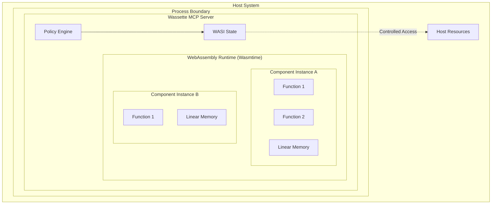
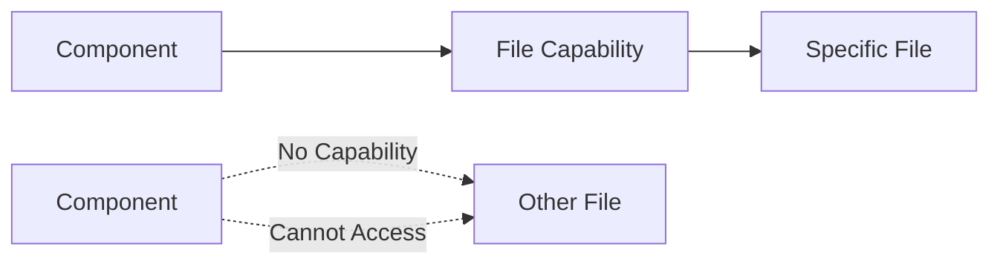

# Sandboxing Overview

Wassette's security model is built on WebAssembly's proven sandboxing technology, enhanced with capability-based access control through WASI (WebAssembly System Interface). This provides multiple layers of isolation and security enforcement.

## Security Architecture

Wassette implements a defense-in-depth security architecture with multiple layers:



## WebAssembly Sandboxing Fundamentals

### Memory Isolation

WebAssembly provides strong memory isolation guarantees:

**Linear Memory Model:**
- Each component instance has its own isolated linear memory space
- No direct access to host memory or other component memory
- All memory access is bounds-checked at runtime
- Memory cannot be executed (data/code separation)

**Stack Protection:**
- WebAssembly has its own stack separate from the host stack
- Stack overflow cannot corrupt host memory
- Function calls are validated at the interface boundary

### Execution Isolation

**Control Flow Integrity:**
- All function calls are statically validated
- No arbitrary jumps or code modification possible
- Indirect calls are validated through typed function tables

**Type Safety:**
- All operations are type-checked at compile and runtime
- No type confusion or memory corruption possible
- Interface types ensure data structure integrity

### Resource Isolation

**CPU Limits:**
- Execution time can be bounded per component instance
- Infinite loops are automatically detected and terminated
- CPU usage monitoring and throttling

**Memory Limits:**
- Maximum memory allocation per component instance
- Automatic garbage collection and memory reclamation
- Memory usage monitoring and alerting

## WASI Capability System

WASI extends WebAssembly with a capability-based system interface that provides secure access to system resources.

### Capability-Based Access Control

Unlike traditional permission systems, WASI uses unforgeable capabilities:



**Key Properties:**
- **Unforgeable**: Capabilities cannot be created by components
- **Transferable**: Capabilities can be passed between components (when allowed)
- **Revocable**: Host can revoke capabilities at any time
- **Least Privilege**: Components only get capabilities they need

### WASI Interface Categories

**Core Interfaces:**
- `wasi:clocks` - Time and date access
- `wasi:random` - Cryptographically secure random numbers
- `wasi:io` - Basic I/O operations

**Filesystem Interfaces:**
- `wasi:filesystem` - File and directory operations
- Capabilities grant access to specific paths only
- Fine-grained operation control (read, write, create, delete)

**Network Interfaces:**
- `wasi:http` - HTTP client capabilities
- `wasi:sockets` - TCP/UDP socket operations
- Host-controlled destination restrictions

## Wassette's Security Enhancements

### Policy-Driven Capabilities

Wassette enhances WASI with explicit policy control:

```yaml
# Example security policy
version: "1.0"
permissions:
  storage:
    allow:
      - uri: "fs:///workspace/**"
        access: ["read", "write"]
    deny:
      - uri: "fs:///workspace/secrets/**"
  
  network:
    allow:
      - host: "api.safe-service.com"
        port: 443
        protocol: "https"
    deny:
      - host: "*.internal.company.com"
```

### Multi-Level Security Enforcement

**1. Policy Engine Enforcement:**
- Validates all capability requests against policy
- Denies access before reaching WASI layer
- Provides detailed audit logging

**2. WASI Runtime Enforcement:**
- WebAssembly runtime validates all system calls
- Ensures only granted capabilities can be used
- Provides second layer of defense

**3. Operating System Enforcement:**
- Standard OS security boundaries still apply
- Process isolation and user permissions
- Additional protection against runtime vulnerabilities

## Threat Model and Protections

### Protected Against

**Malicious Components:**
- ✅ **Memory corruption attacks**: WebAssembly memory safety prevents buffer overflows
- ✅ **Code injection**: No ability to modify or inject executable code
- ✅ **Privilege escalation**: Capability system prevents unauthorized access
- ✅ **Resource exhaustion**: CPU and memory limits prevent DoS attacks
- ✅ **Data exfiltration**: Network policies control outbound connections
- ✅ **File system attacks**: Filesystem policies restrict path access

**Vulnerable Components:**
- ✅ **RCE exploitation**: Sandboxed execution limits impact of vulnerabilities
- ✅ **Dependency attacks**: Each component is isolated from others
- ✅ **Supply chain attacks**: Signed components and policy verification
- ✅ **Side-channel attacks**: Process-level isolation prevents cross-component attacks

### Security Boundaries

**Strong Boundaries (Cannot be bypassed):**
- WebAssembly memory isolation
- Type safety enforcement
- WASI capability system
- Process isolation

**Policy Boundaries (Configurable):**
- Filesystem access paths
- Network destination hosts
- Environment variable access
- Resource usage limits

### Known Limitations

**Speculative Execution:**
- WebAssembly inherits CPU speculative execution behavior
- Same-process components may share some CPU state
- Mitigation: Process-level isolation for high-security use cases

**Timing Attacks:**
- Components can measure execution time
- May reveal information about host system state
- Mitigation: Time quantization and noise injection (future)

**Resource Measurement:**
- Components can measure their own resource usage
- May reveal information about host system load
- Mitigation: Resource virtualization (future)

## Security Monitoring and Observability

### Audit Logging

All security-relevant events are logged:

```rust
#[derive(Debug, Serialize)]
struct SecurityAuditEvent {
    timestamp: DateTime<Utc>,
    component_id: String,
    event_type: SecurityEventType,
    resource: String,
    action: String,
    result: SecurityResult,
    policy_version: String,
}

enum SecurityEventType {
    FilesystemAccess,
    NetworkAccess,
    EnvironmentAccess,
    PolicyViolation,
    CapabilityGrant,
    CapabilityRevoke,
}

enum SecurityResult {
    Allowed,
    Denied,
    Error,
}
```

### Real-time Monitoring

Security events are logged through the standard Rust logging infrastructure:

- **Permission denial rates** by component and resource type
- **Unusual access patterns** that may indicate compromise
- **Resource usage anomalies** that may indicate attacks
- **Policy violations** and their frequency

### Alerting

Configurable alerts for security events:

```yaml
# Example alert configuration
alerts:
  high_denial_rate:
    condition: "permission_denials > 10 per minute"
    severity: "warning"
    action: "notify_security_team"
  
  privilege_escalation_attempt:
    condition: "policy_violation.type == 'capability_request'"
    severity: "critical"
    action: "disable_component"
```

## Comparison with Other Isolation Technologies

### vs. Container Isolation

| Aspect | Wassette/WebAssembly | Containers |
|--------|---------------------|------------|
| **Memory Isolation** | Memory-safe, type-checked | Process boundaries only |
| **Startup Time** | Microseconds | Seconds |
| **Resource Overhead** | Minimal (KB) | Significant (MB-GB) |
| **Capability Control** | Fine-grained | Coarse-grained (capabilities, cgroups) |
| **Portability** | Universal binary format | OS-specific images |
| **Attack Surface** | Minimal (Wasm + WASI) | Larger (full OS stack) |

### vs. Process Isolation

| Aspect | Wassette/WebAssembly | Process Isolation |
|--------|---------------------|------------------|
| **Memory Safety** | Guaranteed by runtime | Depends on language |
| **IPC Overhead** | Function calls | System calls, pipes |
| **Resource Sharing** | Controlled sharing | Complex shared memory |
| **Debugging** | WebAssembly tooling | Native debuggers |
| **Language Support** | Any → Wasm | Native binaries only |

### vs. Virtual Machines

| Aspect | Wassette/WebAssembly | Virtual Machines |
|--------|---------------------|------------------|
| **Resource Usage** | Very low | High |
| **Boot Time** | Instant | Minutes |
| **Guest OS** | Not needed | Full OS required |
| **Hardware Support** | Software-based | Hardware virtualization |
| **Density** | Thousands per host | Tens per host |

## Best Practices for Secure Component Development

### Minimize Attack Surface

```wit
// Good: Specific, minimal interface
world file-processor {
  export process-file: func(content: string) -> result<string, string>;
}

// Avoid: Overly broad interfaces
world system-tool {
  export execute-command: func(cmd: string, args: list<string>) -> result<string, string>;
}
```

### Validate All Inputs

```rust
// Good: Input validation
fn process_file(content: String) -> Result<String, String> {
    if content.len() > MAX_FILE_SIZE {
        return Err("File too large".to_string());
    }
    
    if !content.is_ascii() {
        return Err("Non-ASCII content not supported".to_string());
    }
    
    // Process content...
}
```

### Error Handling

```rust
// Good: Secure error handling
fn read_config() -> Result<Config, String> {
    match std::env::var("CONFIG_PATH") {
        Ok(path) => {
            // Only return generic errors to prevent information leakage
            load_config(&path).map_err(|_| "Failed to load configuration".to_string())
        }
        Err(_) => Err("Configuration path not provided".to_string()),
    }
}
```

### Resource Management

```rust
// Good: Bounded operations
fn process_data(data: Vec<u8>) -> Result<Vec<u8>, String> {
    const MAX_ITERATIONS: usize = 1000;
    const MAX_OUTPUT_SIZE: usize = 1_000_000;
    
    let mut result = Vec::new();
    for (i, byte) in data.iter().enumerate() {
        if i >= MAX_ITERATIONS {
            break;
        }
        
        if result.len() >= MAX_OUTPUT_SIZE {
            return Err("Output size limit exceeded".to_string());
        }
        
        result.push(transform_byte(*byte));
    }
    
    Ok(result)
}
```

## Security Testing and Validation

### Manual Security Testing

Security validation should include:

- **Component isolation testing**: Verify components cannot access each other
- **Policy bypass testing**: Attempt to circumvent permission policies  
- **Resource exhaustion testing**: Verify resource limits are enforced
- **Interface boundary testing**: Validate type safety at WASI interfaces

### Security Assessment Practices

When evaluating component security:

- Test components with minimal permission policies
- Verify permission denials are handled gracefully
- Validate that unauthorized access attempts fail appropriately
- Monitor component resource usage patterns

## Incident Response

### Security Incident Detection

Automated detection of security incidents:

- Unusual permission denial patterns
- Resource usage spikes
- Policy violation clusters
- Component crash patterns

### Response Procedures

1. **Immediate Containment**:
   - Disable affected component
   - Revoke all capabilities
   - Isolate component instance

2. **Analysis**:
   - Review audit logs
   - Analyze component behavior
   - Determine impact scope

3. **Recovery**:
   - Update component with security fix
   - Strengthen policies if needed
   - Monitor for similar incidents

## Next Steps

- Learn about [Policy Schema](./policy-schema.md) for detailed policy configuration
- Explore [Security Tradeoffs](./security-tradeoffs.md) compared to native solutions
- Check out [Architecture](../architecture/system-architecture.md) for implementation details