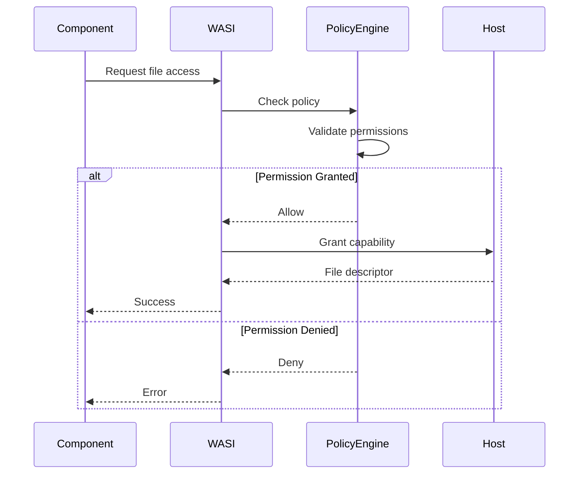

# Sandboxing

Wassette's sandboxing system provides strong isolation guarantees for WebAssembly components, ensuring that untrusted code cannot compromise the host system. This guide explains how sandboxing works and what protections it provides.

## Overview

Sandboxing in Wassette operates at multiple levels:

1. **WebAssembly Virtual Machine**: Memory-safe execution environment
2. **WASI Capability Model**: Controlled system resource access  
3. **Wassette Policy Engine**: Fine-grained permission enforcement
4. **Resource Limits**: CPU, memory, and I/O constraints

## WebAssembly Sandbox

### Memory Isolation

WebAssembly provides strong memory isolation guarantees:

**Linear Memory Model**
- Components have isolated linear memory spaces
- No direct access to host memory
- Memory bounds are automatically enforced
- Buffer overflows are impossible

**Memory Safety**
```
┌─────────────────┐  ┌─────────────────┐
│   Component A   │  │   Component B   │
│                 │  │                 │
│ ┌─────────────┐ │  │ ┌─────────────┐ │
│ │   Memory    │ │  │ │   Memory    │ │
│ │   0-64KB    │ │  │ │   0-32KB    │ │
│ └─────────────┘ │  │ └─────────────┘ │
└─────────────────┘  └─────────────────┘
         │                     │
         └─────────┬───────────┘
                   │
         ┌─────────▼─────────┐
         │   Host Memory     │
         │   (Isolated)      │
         └───────────────────┘
```

### Execution Control

**Stack Safety**
- Separate execution stack per component
- Stack overflow protection
- No stack smashing attacks possible

**Control Flow Integrity**
- Only valid function calls allowed
- No arbitrary jumps to host code
- Structured control flow enforcement

**Instruction Validation**
- All instructions validated at load time
- No self-modifying code
- Deterministic execution model

### Resource Bounds

**Fuel System**
```rust
// Example fuel configuration
let fuel_limit = 1_000_000; // Maximum instructions
engine.set_fuel_limit(fuel_limit);

// Fuel is consumed during execution
while component.has_fuel() {
    component.execute_instruction();
}
```

**Memory Limits**
```rust
// Memory configuration
let memory_config = MemoryConfig {
    initial_pages: 16,    // 1MB initial
    maximum_pages: 1024,  // 64MB maximum
    growth_rate: 1,       // 1 page per allocation
};
```

## WASI Capability Model

### Capability-Based Security

WASI implements a capability-based security model where:

- Components have no ambient authority
- All system access requires explicit capabilities
- Capabilities are unforgeable tokens
- Capabilities can be revoked at any time

### Capability Types

**File Descriptors**
```wit
interface filesystem {
    resource file-descriptor {
        read: func() -> result<list<u8>, error>;
        write: func(data: list<u8>) -> result<(), error>;
    }
    
    // File descriptors are capabilities
    open: func(path: string) -> result<file-descriptor, error>;
}
```

**Network Sockets**
```wit
interface sockets {
    resource tcp-socket {
        connect: func(address: string, port: u16) -> result<(), error>;
        send: func(data: list<u8>) -> result<(), error>;
    }
    
    // Socket creation requires capabilities
    create-tcp-socket: func() -> result<tcp-socket, error>;
}
```

### Capability Granting

Capabilities are granted through WASI imports:

```rust
// Host grants specific capabilities
let mut linker = Linker::new(&engine);

// Grant filesystem access to specific directory
let filesystem_cap = HostFilesystem::new("/workspace");
linker.instance("wasi:filesystem/filesystem", filesystem_cap)?;

// Grant network access to specific hosts  
let network_cap = HostNetwork::new(&["api.example.com"]);
linker.instance("wasi:sockets/tcp", network_cap)?;
```

## Wassette Policy Enforcement

### Policy Validation

Before granting WASI capabilities, Wassette validates requests against policies:



### Runtime Monitoring

Wassette continuously monitors resource usage:

```rust
pub struct ResourceMonitor {
    memory_usage: AtomicU64,
    cpu_time: AtomicU64,
    file_handles: AtomicU32,
    network_connections: AtomicU32,
}

impl ResourceMonitor {
    fn check_limits(&self, limits: &ResourceLimits) -> Result<(), Error> {
        if self.memory_usage.load(Ordering::Relaxed) > limits.max_memory {
            return Err(Error::MemoryLimitExceeded);
        }
        
        if self.cpu_time.load(Ordering::Relaxed) > limits.max_cpu_time {
            return Err(Error::CpuLimitExceeded);
        }
        
        Ok(())
    }
}
```

## Process Isolation

### Component Instances

Each component execution creates a fresh instance:

```rust
// New instance for each call
let instance = component.instantiate(&mut store)?;

// Fresh memory and state
let memory = instance.get_memory(&mut store, "memory")?;
assert_eq!(memory.data_size(&store), 0); // Empty initially

// Call function with isolated state
let result = instance.call_func(&mut store, "main", &args)?;
```

### State Isolation

Components cannot share state between executions:

- **Fresh Memory**: Each call starts with clean memory
- **No Globals**: No persistent global variables
- **Isolated Filesystem**: Virtual filesystem per execution
- **Separate Network**: Independent network namespace

### Inter-Component Isolation

Components are isolated from each other:

```
┌─────────────────┐  ┌─────────────────┐
│   Component A   │  │   Component B   │
│                 │  │                 │
│ • Own memory    │  │ • Own memory    │
│ • Own files     │  │ • Own files     │
│ • Own network   │  │ • Own network   │
│ • Own CPU quota │  │ • Own CPU quota │
└─────────────────┘  └─────────────────┘
         ▲                     ▲
         │                     │
         └─────────┬───────────┘
                   │
         ┌─────────▼─────────┐
         │   Wassette Host   │
         │   (Mediates All   │
         │    Communication) │
         └───────────────────┘
```

## Resource Limits

### Memory Management

**Heap Limits**
```yaml
limits:
  memory:
    initial: "16MB"     # Starting heap size
    maximum: "128MB"    # Maximum heap size
    page_limit: 2048    # Maximum WebAssembly pages
```

**Memory Tracking**
```rust
fn track_memory_allocation(size: u32) -> Result<*mut u8, Error> {
    let current = MEMORY_USAGE.fetch_add(size as u64, Ordering::Relaxed);
    
    if current + size as u64 > MEMORY_LIMIT {
        MEMORY_USAGE.fetch_sub(size as u64, Ordering::Relaxed);
        return Err(Error::OutOfMemory);
    }
    
    allocate_memory(size)
}
```

### CPU Controls

**Execution Time Limits**
```rust
let start_time = Instant::now();
let timeout = Duration::from_secs(10);

while !component.is_finished() {
    if start_time.elapsed() > timeout {
        return Err(Error::ExecutionTimeout);
    }
    
    component.step();
}
```

**Instruction Counting**
```rust
// Fuel-based instruction limiting
let fuel_consumed = store.fuel_consumed();
if fuel_consumed > MAX_INSTRUCTIONS {
    return Err(Error::InstructionLimitExceeded);
}
```

### I/O Throttling

**File Operation Limits**
```rust
struct FileHandle {
    read_quota: AtomicU64,
    write_quota: AtomicU64,
    operation_count: AtomicU32,
}

impl FileHandle {
    fn read(&self, buffer: &mut [u8]) -> Result<usize, Error> {
        let bytes_read = self.inner_read(buffer)?;
        
        let remaining = self.read_quota.fetch_sub(bytes_read as u64, Ordering::Relaxed);
        if remaining < bytes_read as u64 {
            return Err(Error::ReadQuotaExceeded);
        }
        
        Ok(bytes_read)
    }
}
```

**Network Rate Limiting**
```rust
struct NetworkConnection {
    bandwidth_limiter: TokenBucket,
    connection_timeout: Duration,
}

impl NetworkConnection {
    fn send(&mut self, data: &[u8]) -> Result<(), Error> {
        // Wait for tokens based on data size
        self.bandwidth_limiter.consume(data.len())?;
        
        // Send with timeout
        self.socket.send_timeout(data, self.connection_timeout)
    }
}
```

## Attack Prevention

### Common Attack Vectors

**Buffer Overflow**
- Prevented by WebAssembly bounds checking
- Automatic memory bounds validation
- No direct pointer arithmetic

**Code Injection**
- Prevented by WebAssembly validation
- No self-modifying code allowed
- Control flow integrity enforced

**Resource Exhaustion**
- Prevented by resource limits
- CPU time limits
- Memory usage limits
- I/O rate limiting

**Privilege Escalation**
- Prevented by capability model
- No ambient authority
- Explicit permission grants only

### Real-World Examples

**Fork Bomb Prevention**
```rust
// Prevent process creation
fn create_process() -> Result<Process, Error> {
    Err(Error::OperationNotPermitted("Process creation not allowed"))
}
```

**Network Scanning Prevention**
```rust
fn connect_to_host(host: &str) -> Result<Connection, Error> {
    if !is_host_allowed(host) {
        return Err(Error::HostNotAllowed(host.to_string()));
    }
    
    // Additional rate limiting
    if connection_rate_exceeded() {
        return Err(Error::RateLimitExceeded);
    }
    
    establish_connection(host)
}
```

**Data Exfiltration Prevention**
```rust
fn write_file(path: &str, data: &[u8]) -> Result<(), Error> {
    // Check path permissions
    if !is_path_writable(path) {
        return Err(Error::PathNotWritable(path.to_string()));
    }
    
    // Check data size limits
    if data.len() > MAX_WRITE_SIZE {
        return Err(Error::WriteTooLarge);
    }
    
    perform_write(path, data)
}
```

## Monitoring and Observability

### Security Events

Wassette logs all security-relevant events:

```json
{
  "timestamp": "2024-01-15T10:30:00Z",
  "level": "WARN", 
  "event": "permission_denied",
  "component_id": "untrusted-component",
  "operation": "file_write",
  "path": "/etc/passwd",
  "policy_violation": "path_not_allowed"
}
```

### Performance Metrics

Resource usage is continuously monitored:

```json
{
  "component_id": "weather-tool",
  "metrics": {
    "memory_usage": "45MB",
    "cpu_time": "2.3s", 
    "file_operations": 15,
    "network_requests": 3,
    "execution_time": "1.2s"
  }
}
```

### Alerting

Security violations trigger alerts:

```yaml
alerts:
  - name: "Sandbox Escape Attempt"
    condition: "permission_denied AND operation='memory_access'"
    severity: "critical"
    action: "terminate_component"
  
  - name: "Resource Exhaustion"
    condition: "memory_usage > 90%"
    severity: "warning"
    action: "throttle_component"
```

## Best Practices

### For Component Developers

1. **Minimal Resource Usage**: Use only what you need
2. **Graceful Degradation**: Handle resource limits gracefully
3. **Error Handling**: Properly handle permission errors
4. **Resource Cleanup**: Clean up resources after use

### For Platform Operators

1. **Conservative Limits**: Start with strict limits, relax as needed
2. **Monitor Usage**: Track resource usage patterns
3. **Regular Audits**: Review component permissions regularly
4. **Incident Response**: Have procedures for security violations

### For Security Reviewers

1. **Policy Validation**: Review all component policies
2. **Resource Analysis**: Analyze resource usage patterns
3. **Attack Simulation**: Test with malicious inputs
4. **Limit Testing**: Verify resource limits are enforced

## Advanced Topics

### Custom Sandboxing

Wassette allows custom sandbox configurations:

```rust
let sandbox_config = SandboxConfig::builder()
    .memory_limit(64 * 1024 * 1024)  // 64MB
    .cpu_time_limit(Duration::from_secs(10))
    .file_descriptor_limit(100)
    .network_connection_limit(10)
    .enable_fuel_metering(true)
    .enable_memory_protection(true)
    .build();

let sandbox = Sandbox::new(sandbox_config)?;
```

### Sandbox Escape Detection

Wassette includes mechanisms to detect sandbox escape attempts:

```rust
fn detect_escape_attempt(operation: &str, target: &str) -> bool {
    match operation {
        "memory_access" if !is_valid_memory_address(target) => true,
        "system_call" if is_restricted_syscall(target) => true,
        "file_access" if is_outside_sandbox(target) => true,
        _ => false,
    }
}
```

## Troubleshooting

### Common Issues

**Permission Denied Errors**
- Check component policy file
- Verify required permissions are granted
- Review audit logs for specific denial reasons

**Resource Limit Exceeded**
- Increase memory or CPU limits
- Optimize component resource usage
- Check for resource leaks

**Sandbox Violations**
- Review component code for unsafe operations
- Check for attempted system calls
- Verify WebAssembly module integrity

### Debug Tools

```bash
# Check sandbox status
wassette sandbox status --component weather-tool

# Monitor resource usage
wassette monitor --component weather-tool --interval 1s

# Analyze security events
wassette audit --component weather-tool --since 1h
```

## Next Steps

- Learn about the [Permission System](../design/permission-system.md) in detail
- Understand [Security Model](./security-model.md) concepts
- Review [Development Best Practices](../development/best-practices.md)
- Explore [Monitoring and Observability](../reference/configuration.md#monitoring)